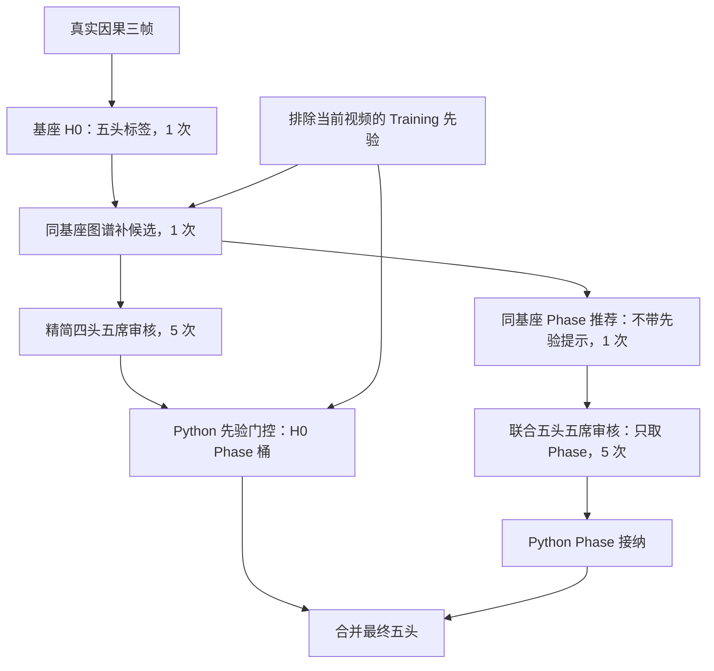

# 当前主线：先验门控 + 联合 Phase

2026-09-11 按用户明确要求设为 **`prior-gated-joint-mainline-v1.0.0`**。
[默认配置](DEFAULT_PIPELINE_VERSION.json)由 `scripts/run_pipeline.py` 读取，转入 `scripts/run_prior_gated_joint_mainline.py`。
[冻结清单](BEST_PIPELINE_VERSION.json)与[验证报告](docs/PRIOR_GATED_JOINT_MAINLINE_FREEZE_2026-09-11.md)记录原始证据，不因切换默认而改写。

## 架构

两个审核分支并行；Phase 不回流先验。每目标 13 次，无盲投 Phase 面板。
门控 veto 0.01 / add 0.70，Phase 唯一最高且均分至少 4 并严格优于当前阶段才替换。

当前冻结基座仍为 Gemini 3.8 Flash；五席为 GLM 5.3 Flash、Qwen 3.5 35B A3B、GPT 5.6 Luna、Gemini 3.5 Flash Lite、DeepSeek V4 Flash Vision Exp。
基座三方比较另走 `scripts/compare_mainline_backbones.py`，不覆盖冻结基座或原始确认结果。

六目标对照已完成，推荐四视频准备继续使用 **Gemini 3.8 Flash**。
[完整对照、费用及局限](docs/MAINLINE_BACKBONE_COMPARISON_2026-09-11.md) · [训练基座选择](TRAINING_BASE_MODEL_SELECTION.json)。
本轮 Gemini 最终平均 F1 75.08、IVT F1 66.67，但联合 Phase 改坏 1 个目标；完整保留负面编辑。

## 入口与边界

- `python scripts/run_pipeline.py`：显示当前选择，无 API 调用。
- `scripts/run_prior_gated_joint_mainline.py`：冻结主线的 replay / prepare / preflight / execute / score / freeze。
  prepare 当前仍是固定 Testing 确认协议，**不是四个 Training 视频的全量采集器**。
- `scripts/compare_mainline_backbones.py`：6 个 Training 目标上比较 Sol / Gemini / Qwen，最多 234 次。
- 没有启动全量 Training 推理或 Gate 训练数据收集。六目标比较只能作开发选型依据。

主线按用户选择启用；此前 24 目标确认有 1 个 H0 失败，未通过完整性标准，联合 Phase 无额外收益。
选择默认不代表已证明总体最优。历史版本完整保存在[旧流程页](docs/history/LATEST_PIPELINE_before_mainline_20260911.md)。
