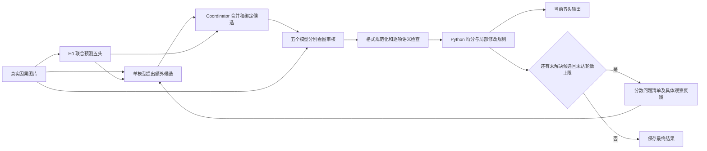
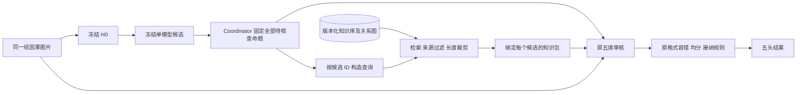
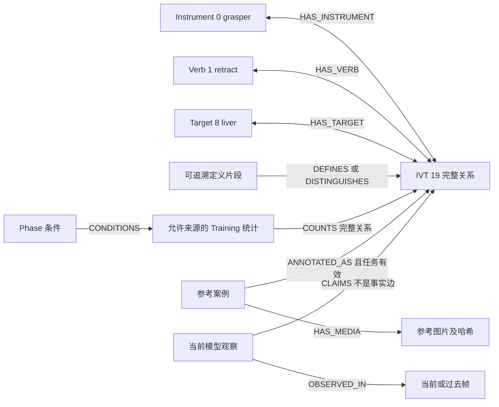

# GraphRAG 在 Verifier／Repair 中的位置、接口与最小对照

日期：2026-09-08。状态：**代码核实后的设计，尚未实现 GraphRAG，也未为本设计启动付费实验。** 当前可复现的修复候选见 [发布与运行指南](VERIFIED_REPAIR_CANDIDATE_2026-09-08.md)，真实成绩见 [修复实验报告](REPAIR_REVISION_RESULTS_2026-09-08.md)。

## 先回答“它不是像一个库，用来看分析结果吗”

这个理解基本正确。需要分清三个部分：**库存资料，检索器找资料，模型结合当前图片判断资料是否适用。** 单独的图数据库不会看图片，也不会自动判断 H0 对错；如果给它另接一个 LLM 做分析，那是新增了判断调用，不能把效果或成本都归给“查库”。

GraphRAG 不必固定在“单模型补候选”之前。它可以作为 Coordinator 随时查询的知识与证据服务：H0 已经是一份分析结果，候选池也是一组待核查命题，第一轮审核的观察和分歧还可以成为下一次查询的问题。**查询发生在哪个时间点，与把资料交给谁使用，是两个不同的设计问题。**

针对本项目，第一项可验证实验建议是：**H0 与候选池先固定，然后按每个候选检索定义、类别边界和来源，把检索包交给五个视觉审核模型。** 这比先继续扩候选更直接检验当前“正确候选已经有了，仍然判错”的问题。候选前扩池、审核后定向复查都保留为后续选项，第一项实验不一起开启。

这仍是待验证方向：当前提示已经包含完整 ID 本体和不少边界说明；如果查库只是重复它们，没有补入经过核对的区分信息，就没有理由期待明显收益。

## 当前真实链路，以及查库能解决哪一段

本次核实的是独立研究入口 [run_evidence_feedback_trial.py](../scripts/run_evidence_feedback_trial.py)，不是默认纯 API 入口，也没有接入 Tracker／Gate。



具体代码边界如下：

| 环节 | 当前实际工作 | GraphRAG 不会自动替代的工作 |
|---|---|---|
| H0 | 三帧或真实可用短历史，联合返回最终五头标签；没有模型置信度 | 图检索不能凭空补出 H0 的置信度 |
| 补候选 | `gemini_proposal` 看图片、当前结果、已有池、问题清单；只能提出额外 I／V／T／IVT ID | 它不直接删标签，也不直接发布修复结果 |
| 合池 | `make_pool` 绑定完整 IVT 及必要组件，去重并保持当前标签可审核 | 合法 ID 与投影一致不代表画面存在该关系 |
| 五席审核 | 各自返回 `rating`、`finding`、`scope`、`image_indices`、`observation` | 五席同意不等于五份独立事实 |
| Repair | `recent_mean_panel.select` 的 Python 规则：有效五席均分 ≥4 支持新增、≤2 支持删除；新 IVT 还须组件通过；删除组件不能破坏保留 IVT | Repair 当前不是一个能读长文并自由裁决的独立 LLM；给它塞图检索报告不会使其理解报告 |
| 后续轮 | 未解决问题及合法观察通过 `review_feedback` 回传补候选模型；重新审核，按预定上限停止 | `MODEL_PASS` 只覆盖已审核池，不证明池外无漏检；不能只对低分或 `UNCLEAR` 查库 |

Phase 保持 H0；以上分支不修复 Phase。提供阶段统计也不会自动改变 Phase 指标。

当前最直接的本地证据是 [已有先验实验](H0_PRIOR_PANEL_EXECUTION_2026-09-07.md)：有效 IVT 目标中，先验新增 28 个候选，补回 10 个 H0 漏检中的 6 个；其中 5 个真实新候选完成审核，却没有任何一位审核者判为存在。最后 IVT micro-F1 仍为 24%。这不是新五席方案的同批对照，不能跨批比较分数，但说明“候选覆盖改善”与“最终修复改善”确实可能脱节。

## 四个可放的位置，分别回答不同问题

| 查询位置／消费者 | 输入是什么 | 返回什么 | 适合解决 | 主要风险／本次选择 |
|---|---|---|---|---|
| H0 后、补候选前；交给提案模型 | H0 标签、预测阶段、当前图像身份、当前已知缺口 | 相关完整 IVT、定义、允许来源的统计排序 | 候选共同漏检 | H0 看错会把查询带偏；旧先验实验已显示扩池不足。后续可测，第一项不启用 |
| **候选固定后、首次审核前；交给五席** | 每个候选的完整关系及组件；不含其他席评分 | 定义、相近类别边界、适用／不适用条件、原文来源 | 已有正确候选被误拒、相似动作或 Target 语义混淆 | **首选最小实验**；候选和接纳规则固定，定位审核层的贡献 |
| 首轮审核后、下一轮判断前 | 具体命题、合法观察、图片引用、分歧；所有预测均标为模型声称 | 针对问题的定义、对照案例、可查看的因果图片引用 | 有明确问题后定向查证 | 不能只触发 `UNCLEAR`：模型可能高分一致判错。需要预定覆盖规则；也要控制多一轮本身的效果 |
| 最终输出后，仅供诊断 | 完整运行记录与检索记录；离线评分阶段才可加入 GT | 错误分类、证据缺口和复现记录 | 研究分析及后续设计 | 不直接提高本次指标；不能把评分 GT 回流到当次推理或检索库 |

“审核后、Repair 前”要进一步说明：**资料必须给一个会使用资料的判断环节。** 若给原来的下一轮补候选模型，就是改变提案上下文；若固定候选、再调用五席复核，就是新的研究分支；若给新的 LLM Repair，则增加了模型与调用。三者不能混为一项 GraphRAG 改动。当前真实第二轮仍然包含补候选，尚未实现“固定池再审”。

## 推荐的最小位置：作为审核旁边的服务



这个第一实验不新增提案调用、不改五席名单、不调整 4 分阈值，不借检索直接发布新增／删除标签。所有预定候选都查询，避免只查模型自认为不确定的项而漏掉高分错判。首次使用相同的一轮审核控制各组时序，不同时测试新多轮触发机制；一轮上限是这项新对照的共同协议，并不是把历史两轮成绩重新计算成一轮成绩。

五个模型可以收到同一份可溯源知识包，但仍各自看当前图片、独立返回原格式。**不得把“频率高”“其他模型说有”“相似案例标有该类”当作当前帧的视觉票。** 同一知识包可能把五席一起带偏，所以需要另外统计“全部同意却错”的变化，不能只报告一致率提高。

## 图里到底存什么

建议分层存放；相连不表示来源和可信性质相同。

| 层 | 节点与数据 | 能提供什么 | 不能推导什么 | 第一实验 |
|---|---|---|---|---|
| 固定本体与定义 | Instrument、Verb、Target、Phase、完整 IVT；来源文件、定义片段、版本 | ID 对应、关系组成、可查证的类别区分 | 合法关系不等于当前存在 | 使用；新增定义必须核对来源 |
| Training 统计 | 独立统计节点，记录任务 mask、分母、视频数、条件和来源集合 | 常见关系、检索排序线索 | 低频或零频不是不存在；高频不是当前真值 | 保留接口；**不向审核者注入频率** |
| Training 参考案例 | 参考视频／短片段、图片哈希、有效标注、来源；连接完整 IVT 与类别定义 | 看过的标准例子和容易混淆的对照 | 别的视频 GT 不能作为当前帧 GT；同类图片不必然是同一动作 | 后续独立验证，首轮不增加参考图片 |
| 当前视频因果证据 | 当前及此前帧、可用图片、模型观察；可选已验证 Tracker 的框／轨迹 | 找回真正可查看的过去证据，帮助解释动作变化 | 当前视频未来、GT、跨实例的同类节点不能混入 | 第一实验保持原输入图片；更长历史另做对照 |
| 模型工作记忆 | 运行 ID、候选、五席原始观察、分数、轮次 | 查询线索、矛盾和已问过的问题 | 审核高分、重复反思、`MODEL_PASS` 都不能写成知识真值 | 可记录；与知识事实隔离 |

建议最小图关系：



上述 ID 已按本项目 [IVT 映射](../src/surgical_agent/research/signals/resources/ivt_components_v1.csv) 和 [名称表](../src/surgical_agent/perception/ontology_prompt.py) 核对：`ivt_19 = grasper / retract / liver = (0,1,8)`；`ivt_9 = grasper / grasp / liver = (0,0,8)`。这里是图结构示例，没有声称某个真实目标帧包含它们。

**完整 IVT 必须是一个整体节点或一个带关系身份的记录。** 不能因图里有“grasper—retract”和“retract—liver”两条常见边，就拼接成当前发生的 IVT。帧级标签也不等于器械实例：两个 grasper 不能因为同类而合并成同一工具；Tracker 的 track ID 也不能自动保证接触点或动作正确。

图数据库不是前提。第一版可用版本化 JSON／SQLite 存节点、边、来源和索引，以确定性代码做一至两跳检索。只涉及 100 个固定 IVT 时，全量枚举也很便宜。若图方法不能比同源普通检索找到更相关的定义／案例，就没有必要部署额外图服务。

## 查询输入 JSON：查询的是命题，不是让数据库复述答案

以下是**设计示例，非当前接口、非真实帧结果**。`DEMO_ONLY`、帧号、状态均为说明结构；ID 的本体含义真实合法。第一实验不读取 GT 标签或 GT mask；视频留出策略由离线索引清单绑定。

```json
{
  "schema_version": "graph_evidence_query_v1_proposed",
  "example_only": true,
  "request_id": "DEMO_ONLY",
  "consumer": "verifier",
  "query_mode": "candidate_definition_and_boundary",
  "target": {
    "video_id": "DEMO_ONLY",
    "frame_id": 101,
    "causal_frame_ids": [51, 76, 101]
  },
  "candidate": {
    "id": "ivt_19",
    "task": "ivt",
    "label_id": 19,
    "components": {"instrument": 0, "verb": 1, "target": 8}
  },
  "context": {
    "current_prediction_status": "UNVERIFIED_MODEL_OUTPUT",
    "phase_hint": null,
    "review_observations": [],
    "questions": [
      "Which sourced definitions distinguish retract from grasp?",
      "What establishes the instrument-action-target relation rather than visible liver alone?"
    ]
  },
  "retrieval_policy": {
    "allowed_layers": ["ontology", "verified_definition"],
    "include_training_frequencies": false,
    "include_reference_images": false,
    "exclude_video_ids": ["DEMO_ONLY"],
    "max_current_video_frame_id": 101,
    "max_hops": 2,
    "max_items": 3,
    "model_claims_are_facts": false
  }
}
```

完整一帧请求应包含全部候选，逐项绑定并按 token 上限分配资料；这里只展示一个候选，不能只审核示例 IVT 而遗漏独立 I／V／T。真实请求必须附冻结候选池哈希、知识库哈希、图检索版本、语料版本、来源过滤策略和缓存键；缓存还要区分视频留出和因果截止帧。

后续若从初审结果查库，`review_observations` 只能放经过现有 `review_feedback` 检查的命题绑定、观察、图片引用、来源席和轮次；分数注明未校准，不能生成“当前帧已证实牵拉肝脏”的查询事实。查询问题应允许相反答案，例如“区分 grasp／retract 需要哪些可观察条件”，不要仅问“为什么它是 retract”。

## 检索输出 JSON：返回资料和缺口，不返回 ACCEPT

下例有意只返回已经能在当前源码找到的映射和项目解释；统计数值与参考图片为空，**没有伪造建好的库、官方定义、案例或 GT**。它也展示了一个可能没有额外价值的检索结果：资料在原 prompt 中已存在。

```json
{
  "schema_version": "graph_evidence_packet_v1_proposed",
  "example_only": true,
  "request_id": "DEMO_ONLY",
  "candidate_id": "ivt_19",
  "status": "PARTIAL",
  "items": [
    {
      "item_id": "ontology_ivt_19",
      "kind": "ONTOLOGY_MAPPING",
      "components": {"instrument": 0, "verb": 1, "target": 8},
      "source": {
        "path": "src/surgical_agent/research/signals/resources/ivt_components_v1.csv",
        "locator": "row ivt=19"
      },
      "establishes_current_frame_presence": false
    },
    {
      "item_id": "project_boundary_grasp_retract",
      "kind": "PROJECT_INTERPRETATION",
      "text": "Gripping tissue alone does not prove retract; visible displacement alone does not identify tissue at the tool tip.",
      "source": {
        "path": "scripts/run_semantic_candidate_trial.py",
        "locator": "BOUNDARIES"
      },
      "already_in_baseline_context": true,
      "establishes_current_frame_presence": false
    }
  ],
  "retrieval_paths": [
    ["ivt_19", "HAS_VERB", "verb_1", "DISTINGUISHED_FROM", "verb_0"]
  ],
  "training_statistics": [],
  "reference_media": [],
  "current_video_media": [],
  "limitations": [
    "No additional verified dataset definition has been supplied in this example.",
    "The contrast path is a proposed index relation; no implemented graph is claimed.",
    "This packet does not decide whether the candidate is present."
  ],
  "fallback": "RETAIN_EXISTING_VISUAL_REVIEW_POLICY"
}
```

正式索引中，来源要有内容哈希、版本、许可证／可用范围、来源性质；图边也要有原始来源，不能只给一条无出处的检索路径。若模型生成了定义摘要，应保存原文与摘要生成信息，并在纳入“已核实定义”前完成核对。项目 prompt 的解释不能重命名为数据集官方标注规则。

审核输出第一版保持当前 JSON，不让资料里出现另一套分数覆盖 `rating`。五席仍须引用**当前目标图片**给视觉结论；知识文档或别的视频图片不能充当 `image_indices` 中的当前图。记录请求级知识包哈希即可证明模型收到什么，不必为了第一实验同时重写所有审核输出 schema。模型实际是否采纳了资料，需要看观察内容及结果，不能由“引用存在”自动判定。

## 数据边界、失败回退和防止自我强化

1. **本体真值、统计事实、图片证据和模型声称分开。** “IVT 19 的组件为 (0,1,8)”是映射事实；“该阶段有多少比例标到 IVT 19”是带分母的统计；“本帧有 IVT 19”仍是视觉命题。不能互相替代。
2. **按整段视频留出。** Training 开发目标的统计、案例、从案例总结的说明、embedding 索引、重排训练、图社区摘要都排除该目标视频，不只是排除目标帧。若以后用 OOF Tracker，当前 Training 视频也必须来自未见该视频训练的模型。Testing 从不用于建库、定阈值或选方案。
3. **按任务 mask 统计。** 缺失 Target 或 IVT 标注不记负例；阶段条件统计需要该任务及 Phase 同时有效。保存有效帧数、有效视频数、正例数，沿用逐视频等权及必要的稀疏条件回退，避免长视频垄断频率。表中的零次观察不做硬删除规则。
4. **当前视频严格因果。** 检索出的同视频图片须存在且帧号不晚于目标；第一实验保持原三帧，不新增更早历史。后续若扩大历史，需要相同图片数的均匀／近期采样对照，分清“多看了图”和“图检索”的贡献。过去的预测只算预测，不能读取过去帧 GT。
5. **阶段只做软线索。** final-only H0 没有阶段置信度，不能自造；查询不得仅凭一个 Phase 硬裁掉其他合法 IVT。统计不足或阶段不可靠时使用全局检索；第一审核实验根本不输入阶段频率。
6. **模型写回隔离。** 当前结果、五席评分、反思文字保存在运行工作区，不自动更新可信知识节点。未来若做长期记忆，须独立版本化，并为评测目标重新执行来源隔离；不能用测试时不断写回的错标签形成循环佐证。
7. **异常回退可重现。** 未命中、空图、过期哈希、来源不允许、断链和超长返回均记录原因；对应候选按当前无检索审核策略继续。图检索不创建虚假视觉支持，不直接提高均分或删除标签。某个审核失败仍使用现有无效证据处理，不因查到资料而制造第五票。

## 从论文和官方方法真正借什么

Microsoft GraphRAG 的 Local Search 以查询中的实体为入口，组合相关关系与原文资料给 LLM；它支持“拿当前命题查相关知识”的位置，不要求放在初始预测之前。[官方 Local Search](https://microsoft.github.io/graphrag/query/local_search/)

Global Search 面向整库主题和总体概括，利用社区报告作汇总；这与“这一帧是否有某个 IVT”的精细视觉核查不同。DRIFT 能从初始问题展开后续查询，但也引入额外生成与遍历。第一实验没有必要把这两套循环搬进来。[官方 Global Search](https://microsoft.github.io/graphrag/query/global_search/)、[官方 DRIFT](https://microsoft.github.io/graphrag/query/drift_search/)

Vgent 把视频片段连成图，先找相关片段，再用结构化子问题筛选，最后把筛过的真实片段与中间结果给模型。它明确分析了“检索到正确片段仍回答错误”的情况。对本项目最有用的借鉴是**检索结果还需检查适用性，并保留可回看的原始证据**。它的长视频问答协议可访问离线构建的视频图；本项目做流式目标帧判断时必须另外禁止未来内容，不能照搬整视频可见范围。论文结果也不能换算成本项目 IVT 的预期涨幅。[Vgent 方法 3.1–3.4](https://arxiv.org/html/2510.14032v1#S3)

本设计采用的是小型领域图检索的思路；没有宣称已运行 Microsoft 的完整 GraphRAG 软件或复现 Vgent。

## 1–2 天能验证的最小计划

目标是回答：**相同候选、相同图片、相同判断规则下，图组织的资料能否让审核分清本来易混淆的关系？** 首先固定资料，再比较检索方法，避免把“多给了一份新知识”误认为“图比表强”。

| 步骤 | 具体工作与交付 | 预计时间 |
|---|---|---|
| 核对语料与离线检索 | 找到确有来源的类别定义／区分说明；区分官方定义和项目解释；固定 source manifest；同源建立普通检索与小图；做视频隔离和命题绑定检查 | 第 1 天，约半天 |
| 判断是否值得调用 | 使用旧记录的候选查询，但不按旧 GT 写特殊规则；检查是否取回新增、相关、可追溯的区分信息。若只有原 prompt 重复内容，先停止，报告缺少新知识 | 第 1 天余下时间 |
| 新样本三组对照 | 拟 12 个新的 Training 目标，优先来自此前四个开发视频以外至少 3 个视频；只按时间与标注可用性定样；调用前冻结完整身份、源版本、预算、停止规则 | 第 2 天 |
| 独立评分与判定 | 先保存各组输出和哈希，再由独立进程关联 GT，报告全部目标和失败 | 第 2 天内 |

三组使用同一份冻结 H0、同一个冻结候选池，执行一轮五席审核及相同 Repair：

| 对照组 | 提供给审核者的附加信息 | 用于回答 |
|---|---|---|
| R0 | 无附加检索资料 | 当前一轮参考值 |
| R-flat | 同一来源库的普通实体／关键词检索，附定义及来源 | 增加这些资料本身是否有用 |
| R-graph | 同源语料，按完整 IVT 与定义关系一至两跳检索，附定义及来源 | 图组织能否比普通检索更有效 |

R-flat／R-graph 固定相同条目数、文本预算和来源权限，均不放 Training 频率与参考图片；共享的内容序列去重。排序规则、每项资料配额和图跳数在调用前冻结，不靠新目标 GT 调整。如果两个方法最后产生完全相同的五席请求，复用同一份原始回复及失败，报告“该目标没有检索差异”；不要重新抽一次模型结果后将差异归因于图。

如果 12 个目标都新跑 H0 和提案，上限是每目标 `1 H0 + 1 提案 + 3×5 审核 = 17` 次，共 **204 次 POST**；其中 R-flat／R-graph 比 R0 多 **120 次**。同一部署方案仍是原来的一组五席，并不是每个目标都运行三套方案。第一版检索用本地确定性代码，不增加在线 LLM 查库调用；额外输入 token、检索耗时、索引构建费用另计。**本文件只给调用上限，不冒充已经核定美元预算；实际实验前须依据冻结模型／路由与最大输入长度计算账户预算。**

必须报告：

- 各头有效 GT 数、micro Precision／Recall／F1、集合 Accuracy；Phase 保持不变。
- 正确新增、错误新增、正确删除、误删正确；改全对、部分改善、改坏、混合变化、无收益替换、不变；不能只列净值。
- 对固定池中真／假命题的支持、反驳、弃权；有益修改放行率、错误修改放行率；五席共同误判数。
- 检索非空率、资料有效来源率、相同请求比例、新增有效区分信息；候选覆盖因为固定池应相同，不能把它报告为本实验的增益。
- 分视频结果、失败回退、实际调用、原生费用／估价／未知费用预留、每目标延迟。12 个目标只支持小样本机制判断，不支持稳定 SOTA 结论。

预定采纳信号：R-graph 相对 R0 和 R-flat，IVT 与 Target F1 均不下降，其中至少一个严格改善，标签总错误减少且改坏目标不增；还要确认收益不全来自单个目标／视频。若只超过 R0、没有超过同源 R-flat，应保留简单检索并如实称为“资料增强”；若全部保留 H0、只有合法率提高或多数一致率提高，不算修复成功。达不到条件就保留当前冻结基线，优先完成正式实验；不继续为图结构本身增加模块。

## 设计结论与未解决事项

当前推荐的是**“查库辅助审核”**，不是“图库代替看图”，也不是把它硬塞在补候选前。Coordinator 可以在不同环节查同一个库，但本次最小实验只改变“固定候选送五席前”的资料输入，便于知道收益来自哪里。

仍需验证的关键点有三项：是否真有超出当前 prompt 的可靠类别资料；这些资料能否改变正确候选被误拒的现象；图检索是否比同源普通检索更好。若问题主要是分辨不清工具尖端、被遮挡组织或三帧不足，文字图谱可能帮不上忙，下一步才考虑带真实图片的参考案例或因果证据检索，并单独控制图片与时间范围。

实施优先级：**先核实语料 → 固定候选后、首次审核前查定义及边界 → 有收益再考虑审核后定向查证 → 确认候选覆盖仍是主要瓶颈后再测候选前扩池。** 本轮只完成了设计文档；上述四步都不表示 GraphRAG 已接入或测出提升。
