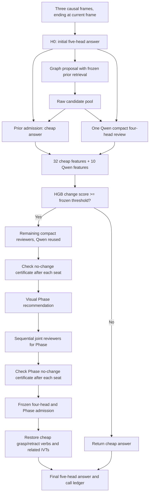

# Frozen PGP pipeline: architecture and execution

The default dispatcher now selects `scripts/run_pgp_pipeline.py`. The selected Gate is the ambiguity-protected, single-Qwen, whole-frame HGB model. Tracker is disabled. This release connects runtime feature extraction, inference routing, conditional reviewer calls, exact stopping and final ambiguity rollback. It does not deploy a service or automatically run paid requests.



The reviewers receive the same H0/raw pool packets as the frozen full-review pipeline. They do not see the prior-adjusted cheap answer, Gate decision, target annotations, other reviewers' responses, or future frames. The graph proposal retains its original prior retrieval hints; the Phase recommender does not receive those hints. Gate features are computed at runtime, after precisely three requests: H0, proposal, Qwen compact. No cached ground truth or future reviewer diagnostic enters the decision.

Whole-frame action 0 returns cheap; action 3 enables the two verification branches. Compact reviewers after Qwen and the Phase branch are executed sequentially in this implementation. Each branch stops independently once the remaining scores cannot alter its output. Unqueried seats never count as invalid responses; an observed invalid response follows the original first-attempt fallback. No implicit retry is added. The already queried Qwen is charged even when the mathematical compact stop depth is zero. Per-target logical calls range from 3 to 13.

## What was validated

- All 6,059 sealed Training rows passed actual H0/proposal parsing, pool reconstruction, prior admission, runtime Gate, conditional cached calls and postprocessing. Every prediction matched the appropriate frozen counterfactual.
- All 42 runtime feature columns exactly matched the training preparation arrays.
- Final fitted model runtime: 3,380 continued targets, 39,870 logical calls, known USD 91.901125, GLM requests 2,356, DeepSeek requests 1,279. These are replay counts, not new paid calls.
- The final-model replay is a runtime parity check, **not** independent accuracy evaluation. The earlier nested outer evaluation remains F1 61.698902 / 36,150 errors / 37,157 calls / known USD 86.408302. Different fitted models and thresholds explain different routes.
- Synthetic tests use real wire builders and a recording mock transport: closed Gate stops after three requests; Qwen is not repeated; malformed proposal/reviewer responses preserve the frozen fallback; queried request bodies match the original full pipeline. Prepared execution is tested with a mocked transport, explicit zero budget and a no-network assertion.
- No paid API execution, Testing/VID110 evaluation, Tracker training or deployment was performed. Live transport is wired but not provider-validated in this turn. Gain retention remains 83.66%, below the 90% goal.

## Commands

Use the local `.venv-p2` environment. The frozen estimator was exported with scikit-learn 1.9.0, NumPy 2.4.6 and joblib 1.5.3; see `requirements-pgp.txt`. Keep those versions for this serialized research model. External datasets, credentials and response caches are not distributed through GitHub.

Show the current pipeline without making any calls:

```powershell
.venv-p2\Scripts\python.exe -B -X utf8 scripts\run_pipeline.py info
```

Offline smoke test and complete cached replay (each output must be new):

```powershell
.venv-p2\Scripts\python.exe -B -X utf8 scripts\run_pipeline.py preflight --output artifacts/preflight/pgp_smoke_new
.venv-p2\Scripts\python.exe -B -X utf8 scripts\run_pipeline.py replay --output artifacts/preflight/pgp_replay_new
```

Post-inference scoring explicitly loads Training annotations, separately from the inference path:

```powershell
.venv-p2\Scripts\python.exe -B -X utf8 scripts\run_pipeline.py score --output artifacts/preflight/pgp_replay_new --annotations artifacts/training/gate/official_behavior_net_v2_20260913/primary_rows.json
```

Preparation creates an image/prior/default/runtime-bound plan from an explicitly named frozen Training source. It makes zero API calls. A zero-budget example:

```powershell
.venv-p2\Scripts\python.exe -B -X utf8 scripts\run_pipeline.py prepare --source artifacts/training/gate/full_official_reviewers_20260912_v1 --output artifacts/preflight/pgp_prepared_new --limit 1 --budget-limits configs/pgp_budget_zero.json
```

Paid execution is available only through `execute --output <prepared-directory> --allow-paid`, with the prepared explicit account caps. This command has **not** been run. Zero caps block dispatch. Plan, input image, prior and Gate/runtime hashes are checked before execution. A durable start marker rejects duplicate or concurrent executions; interruption requires explicit reconciliation and is not blindly retried. Original official transport handles per-request journals, model routing and SQLite budget reservations. The runner accepts Training videos only and does not expose a Testing path.

The source plan must contain the original frozen reviewer configuration and image paths. The preparation step strips Tracker snapshots and old response-cache reuse; live execution starts with fresh H0 and follows Gate decisions. It is not a general raw-video ingestion replacement; it consumes the project's existing prepared causal Training inputs.

## Files and retained versions

- `src/surgical_agent/research/gate/pgp_runtime.py`: shared causal orchestration and feature extraction.
- `scripts/run_pgp_pipeline.py`: cache and wire backends; unified CLI.
- `scripts/pgp_pipeline_execution.py`: prepare, explicit budgeted execution and separate scoring.
- `DEFAULT_PIPELINE_VERSION.json`: full-pipeline selector; old selector saved in `configs/defaults/prior-gated-joint-before-pgp-20260913.json`.
- `DEFAULT_PGP_GATE_VERSION.json`: original frozen Gate weight/threshold selector, preserved.
- `artifacts/preflight/pgp_pipeline_all_20260913_r1/receipt.json` and `runtime_parity_audit.json`: aggregate zero-call runtime evidence.

The previous offline freeze remains historical evidence; the new integration freeze records the new dispatcher and runtime sources. Old Gate models/results and Tracker artifacts are not overwritten or deleted. GitHub includes the selected Gate model and aggregate receipts, not raw surgical data, responses, per-frame annotations, credentials or unrelated local changes.
