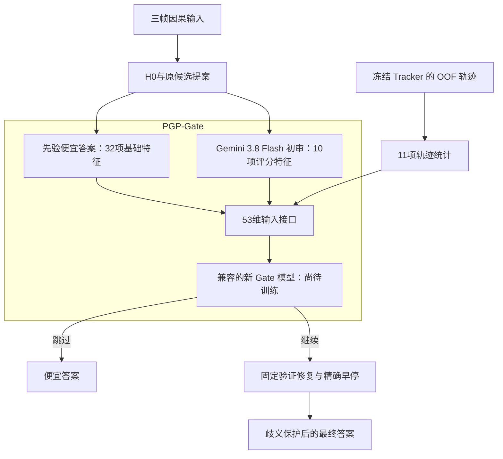

# Tracker + Gemini 3.8 初审接入状态

用户要求接入 Tracker，并将初审由 Qwen 改为 Gemini 3.8 Flash。本次完成运行接口、模型兼容性检查和离线测试，尚无匹配的新 Gate 权重，不能把它宣称为已训练完成的新默认。

## 已完成的实际连接



这张图明确标记了尚待训练的模型，其余新增连接已由执行接口和测试覆盖。Tracker 不传给 H0 或审核员，只进入 Gate。使用 `tracker_clip_v2_oof5_20260906/oof/index.json` 绑定的冻结留出预测；没有重新训练 Tracker，也没有使用查询视频内训练的预测替代 OOF。

实际轨迹特征为：可用性、器械数量和类别数、检测置信度均值/最小值、相对 H0 缺失/额外类别数、历史可用性、新轨迹数、消失轨迹数、轨迹保留率。不声称当前使用了位移、速度或动作真值。

`--tracker off` 保留相同的 53 维 schema，将轨迹特征置零；启用时必须有可用且视频/帧窗口一致的轨迹。模型文件必须声明实际训练和验证过的 Tracker 模式，不能仅因接口支持开关就宣称同一模型已兼容两种模式。

## 初审替换的明确含义

交互审核原来的 Gemini 席从 3.5 Flash Lite 升级为 **google/gemini-3.8-flash / google-ai-studio**，并放在第一席。交互顺序是 Gemini 3.8 → Qwen → GPT → GLM → DeepSeek，仍然五席；并非增加第六个审核员。初审回答在继续审核时复用，不重复请求。

Qwen 不再承担交互初审，但仍是后续审核员。阶段分支维持原来的 Qwen-first 顺序及模型配置，包括该分支原 Gemini 3.5 Flash Lite，避免无要求地改变整个阶段面板。新 Gemini 交互调用的预算预留至少使用原 Gemini 3.8 H0 档费率，而非沿用 Flash Lite 费率；这只是冻结账本的保守预留，不是最新价格承诺。

## 数据与模型阻塞

现有 6,059 条主训练缓存的交互 Gemini 席为 3.5 Flash Lite。Gemini 3.8 的 H0 是初始预测，不是审核评分，不能用作新初审缓存。升级一个审核席还会改变全审核目标，因此不能仅把旧特征名或模型名换掉后沿用旧输出标签。

需要为这些样本获得匹配的 Gemini 3.8 **交互审核回答**，然后复用其余未改变的原始回答，重建审核结果、改变标签与成本，再重新拟合/校准 Gate。新 schema 为 `pgp_tracker_gemini38_hgb_v1`；当前旧 Qwen 42维模型在准备前被拒绝。没有伪造缓存、复用 H0 评分、放宽模型检查或调用付费 API。

当前已验证的默认仍保留为 Qwen/无 Tracker 版本，防止将没有匹配权重的版本标成可运行默认。新配置独立保存于 `configs/pgp_tracker_gemini38.json`，状态 `WIRED_REQUIRES_MATCHING_PROBE_DATA_AND_RETRAINING`。

## 入口与验证

查看真实状态，不发起请求：

```powershell
.venv-p2\Scripts\python.exe -B -X utf8 scripts\run_pgp_tracker_gemini38.py info
```

统一流水线已支持 `--variant tracker-gemini38 --tracker on|off --gate-model <新模型元数据>`。`prepare` 在创建付费计划前验证新模型身份、53维特征和支持的 Tracker 模式；`execute` 读取该版本的实际 Tracker 适配器及 Gemini 3.8 请求后端。现有 `preflight/replay` 明确拒绝把旧缓存用于该新版本。

真实冻结 Tracker 的 VID103、VID23、VID31、VID96 各一条因果样本通过适配器检查。模拟测试覆盖 Tracker 开/关、Gate 开/关、3.8 模型与路由、初审只调用一次、53维输入、错误视频拒绝以及旧权重拒绝。没有新模型精度、成本节省或端到端真实 API 效果的结论。

本次不删除旧模型或结果，不修改 Tracker 权重，不运行 Testing/VID110，不部署。
