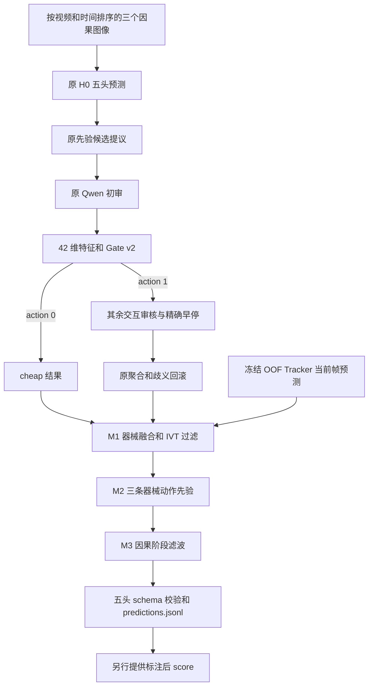

# 当前完整 Pipeline：方案 4

> **2026-09-14 更新：输出模块改为 v2.2（默认）。** 新增两项：
> - 本体过滤：不再把 Tracker 的"标本袋"当作器械输出；
> - 闲置标签清理：删除 Qwen 初审明确给 1 分的闲置三元组，并去掉失去对应闲置三元组的"无动作""无目标"。
>
> 6,059 帧回放结果：F1 从 66.40 升到 67.02，错漏从 32,398 降到 30,774；4 个视频都改善；路由和调用不变。
>
> 如需复现旧行为，加参数 `--output-modules v2.1`。详见 [v2.2 说明](SCHEME4_OUTPUT_MODULES_V22_2026-09-14.md)。下文的 M1–M3 描述仍然适用。

2026-09-14 按用户要求将方案 4 设置为默认研究 pipeline，入口为 `scripts/run_pipeline.py`。当前为 Training 四视频的完整可执行链路，支持缓存回放、预算计划、真实执行和单独评分。已完成两个 Training 目标的实际 API 执行，但两帧都未触发后续审核，不能视为完整分支或独立精度验证；VID110/Testing 尚未验证。Verber/Targeter 新模型、方案 5 和方案 6 均未接入。主线保持原候选提案 prompt。

论文模块划分已另行确认：先验候选＋Qwen 初审＋学习型 Gate 合称 G，验证修复独立为 R，M1–M3 合称 T。第一个主要消融基线为 H0＋R。详见 [模块划分与新消融设计](PIPELINE_MODULE_ABLATION_DESIGN_2026-09-14.md)；无 G 对照尚需实现，本次文档同步没有改变下述运行逻辑。

最新逐帧数据、研究数组、费用凭据及旧数据状态见 [实验数据索引](experiments/DATA_CATALOG_2026-09-14.md)。旧预览和历史探针已明确标注，不能代替当前结果或新消融表。



H0、proposal、Qwen 始终各一次；Gate v2 只决定是否继续交互审核，最多额外四席。每帧 3–7 次逻辑调用，无 Phase 推荐或 Phase 审核请求。Tracker 通过输出融合参与，不进入 Gate 特征，也不作为 Qwen 或其他审核员的提示。

阶段滤波只使用 cheap 的原始 Phase，不递归投票；每视频独立 60 秒窗口，平局保持当前原始预测。运行从每个视频所选第一帧开始建立状态，样本前不存在的历史不会自动补造。使用稀疏子集运行时不能期待等同于完整时间序列。

## 安装、模型与外部数据

沿用仓库 Python 环境与依赖；本次验证使用 `.venv-p2`。Git 中包含最终 Gate v2 权重、模型校验摘要、冻结输入清单、OOF Tracker 预测及结果摘要。原图、完整审核响应缓存和 GT 仍是本地外部数据，不上传 GitHub。

- 默认历史输入缓存：`artifacts/training/gate/full_official_reviewers_20260912_v1/`，包含原 `plan.json`、`priors/` 和 `targets/<key>/result.json`。
- 默认 Tracker：`artifacts/training/tracker_clip_v2_oof5_20260906/oof/index.json`，预测摘要校验且只使用对应视频的 held-out 结果。
- Gate：`artifacts/training/gate/tracker_scheme4_20260914/model.json` 与 `final_estimator.joblib`。加载前校验 SHA-256；阈值为 0.15189561345941022。
- 输入集合：同目录 `replay_inventory.json`，6059 个已冻结 Training key，无 GT 标签。
- 缓存可用 `--source` 指定；Tracker 可用 `--tracker-index` 指定有效 OOF index。真实执行要求源计划的图像路径及 SHA-256 有效。

此版本消费已经生成的 Tracker 预测，不会在每次执行时重新训练检测器或遍历原始视频生成预测。新视频接入需要先生成其 Tracker 预测并完成独立协议；当前版本明确拒绝 VID110/Testing。

## 统一命令

查看当前默认版本（不调用 API）：

```powershell
.venv-p2\Scripts\python.exe scripts/run_pipeline.py info
```

小规模端到端缓存检查和全量回放（输出必须为新目录）：

```powershell
.venv-p2\Scripts\python.exe scripts/run_pipeline.py preflight --output artifacts/preflight/scheme4_check
.venv-p2\Scripts\python.exe scripts/run_pipeline.py replay --output artifacts/preflight/scheme4_all
.venv-p2\Scripts\python.exe scripts/run_pipeline.py score --output artifacts/preflight/scheme4_all --annotations artifacts/training/gate/official_behavior_net_v2_20260913/primary_rows.json
```

`replay/preflight` 禁止网络，不读取评分标注，按视频/时间排序；`score` 才读取显式提供的 Training 标注。`scores.json` 是最终全量模型在所选数据上的结果，不是嵌套外层结果。

预算准备与真实执行示例：先创建 `caps.json`，列出所有账户的有限非负上限：

```json
{"openrouter_usd":"1","aliyun_cny":"1","glm_requests":"8","deepseek_requests":"8","xai_usd":"0"}
```

```powershell
.venv-p2\Scripts\python.exe scripts/run_pipeline.py prepare --limit 8 --budget-limits caps.json --output artifacts/experiments/scheme4_live8
# 只有本轮真实请求预算已获批准后运行下一行。
.venv-p2\Scripts\python.exe scripts/run_pipeline.py execute --output artifacts/experiments/scheme4_live8 --allow-paid
.venv-p2\Scripts\python.exe scripts/run_pipeline.py score --output artifacts/experiments/scheme4_live8 --annotations artifacts/training/gate/official_behavior_net_v2_20260913/primary_rows.json
```

prepare 会检查图像、Tracker、Gate，冻结源代码、模型、预算、样本和先验摘要，不调用 API。execute 才读取既有凭证并走官方路由；凭证不提交到 Git。上例预算仅为格式示例，不代表已获批准或保证足够。

execute 使用共享持久预算和独占启动标记；不自动重试，重复执行被拒绝。GLM HTTP 400/1301、Qwen HTTP 400/data_inspection_failed 只使对应席位无效；其他既定致命错误、超时/不明结果、身份或路由错误及预算停止都会中止，保留已写出的记录。中止后的部分输出不能作为完整评分结果。

## 验证结果与解释

统一入口完成全部 6059 帧回放，最终预测逐帧匹配研究版本的全量模型结果，0 差异；23600 次逻辑调用，新 API 0 次。整次回放约 113 秒（缓存、Tracker 读取及推理，无在线请求）。最终全量模型训练集 F1 约 66.4002，不替代论文用的嵌套外层 F1 66.3849 / 24047 次调用。

模拟 transport 覆盖 prepare→execute→score、0/1 两种动作、重复执行拒绝、显式付费开关、模型篡改拒绝和默认分发；配合原运行时与输出模块测试共 26 项通过。模拟通过不等于完整在线验证。

已知限制：M1 会误删部分正确 IVT；M2 器械存在不保证动作发生；阶段滤波存在延迟和漏掉短阶段片段。四个 Training 视频反复用于开发。详见 [方案 4 结果](TRACKER_SCHEME4_RESULTS_2026-09-14.md)、[方案 5/6 结果](TRACKER_SCHEMES56_RESULTS_2026-09-14.md) 和 [成本比较](TRACKER_456_VS_NO_TRACKER_COST_TIME_2026-09-14.md)。

## 历史版本与回退

默认清单为 `DEFAULT_PIPELINE_VERSION.json` 与 `DEFAULT_PGP_GATE_VERSION.json`，两者指向完整方案 4。旧版默认清单分别保存在 `configs/defaults/pgp-pipeline-before-scheme4-20260914.json` 和 `configs/defaults/pgp-gate-before-scheme4-20260914.json`。如需回退，应成对恢复；不能将 action=0/1 的 Gate v2 直接交给旧 action=0/3 运行时。

旧审核脚本及原结果保留。早期报告里的“默认未改”描述对应当时实验状态；本次默认切换由用户随后明确授权。
