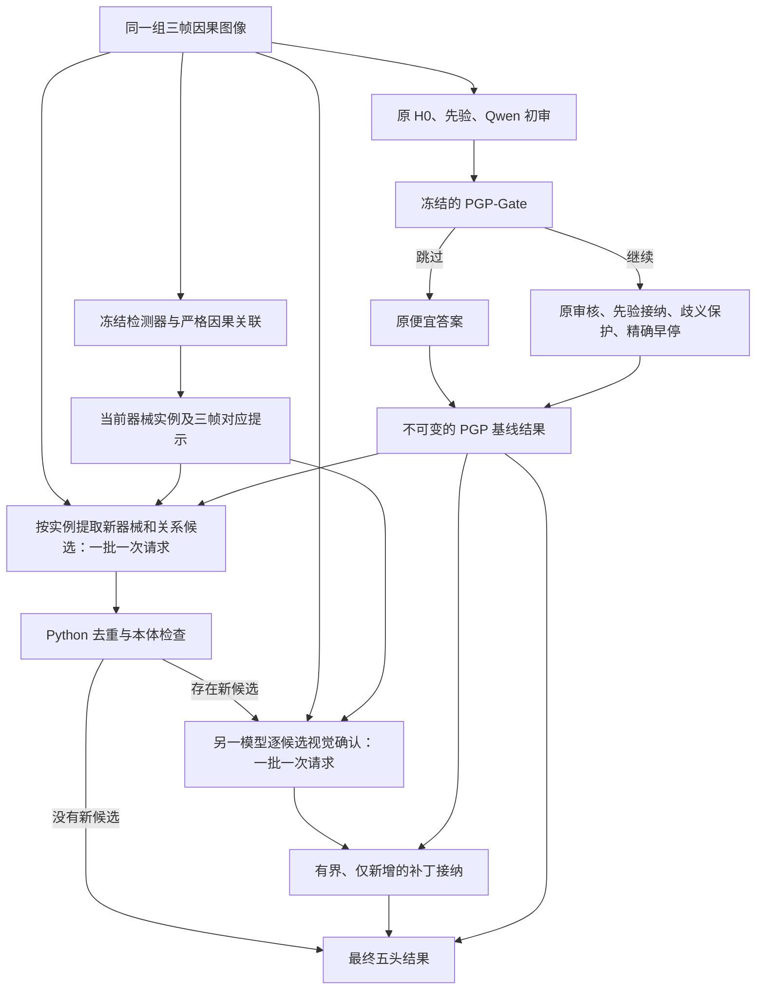

# 固定 PGP-Gate、增加 Tracker 实例补漏的完整流程

状态：设计稿，尚未实现或完成效果验证。本文件只新增设计，不改变默认、权重或已冻结实验。

## 1. 目标与唯一推荐接法

保留用户已经选定的 Qwen PGP-Gate 及其完整原始推理路径，把 Tracker 用于最终精度提升。采用“冻结 PGP 基线 + Tracker 支撑的实例补漏”组合：PGP 负责原有审核路由，补漏分支负责寻找原结果未包含的器械或交互关系。

Tracker 在本地与原流程并行提取，但其信息只进入独立补漏分支，不进入 PGP 的 H0、原提案、Qwen 初审、42 维特征、分数或路由。因此无需为了接入新分支重训旧 Gate；新分支效果仍需验证。

这与将 Tracker 前置到原 PGP proposal 的设计不同：后者会改变原候选池、特征和审核目标，需要重新检查 Gate 分布适配。时间紧且要求保留现有 Gate 时，选择上述隔离接法。

## 2. 端到端数据流



补漏分支在原 Gate 的两个动作之后均可运行。PGP 跳过原审核不意味着该帧永远不能被 Tracker 补漏；新分支不把自己的调用冒充原 Gate 已覆盖的预算。

## 3. 固定基线契约

- 基线入口仍为 `pgp_runtime.run_target` 的无 Tracker、Qwen 初审模式。
- 固定 `DEFAULT_PGP_GATE_VERSION.json` 当前指向的 `pgp-ambiguity-single-qwen-hgb-no-tracker-v1-20260913` 及其模型/estimator 哈希。
- 为每帧单独保存 `pgp_baseline`：H0、cheap、Gate 特征/分数/动作、原预测、原调用键。
- 开启/关闭新分支时，上述字段必须逐字段一致。旧 Gate 的研究状态与既有验证限制继续保留。
- 新分支不改 Phase。其主要评价对象是 instrument、verb、target、IVT；最终仍输出五头，Phase 使用 PGP 基线值。

## 4. Tracker 提供的不是答案，而是可区分的实例

使用已有 corrected Tracker 冻结权重。Training 使用对应 OOF 预测，VID31 的特殊来源按已有审计如实标记；正式后续评价使用符合数据划分的冻结模型。不得把读取完整预测文件误写成使用未来帧。

每个目标只暴露 `[t-50,t-25,t]` 的三帧预测；只以当前帧实际检测到的器械为主要实例锚点。历史消失的器械不能自动算作当前存在。

复用现有检测阈值，每幅图最多 6 个实例，以检测分数排序，分数相同时按类别和框坐标确定顺序；记录截断量。选择过程不依赖 track_id、age 或历史关联，保证检测对照和关联对照具有同样的框集合。检测置信度仅用于本地筛选/审计，不作为大模型投票或关系置信度。

每个实例使用局部 ID，并保留每一帧的原图归一化框及类别假设，例如：

```text
instance_id: T1
current_frame_box: [x, y, w, h]
instrument_hypothesis: grasper
history: 每个可用历史帧的框与局部关联
association_available: true / false
```

两个 grasper 必须是两条实例记录。关联不确定或历史不可用时，使用当前帧独立实例，不编造对应或组织运动。框不被当作器械末端、接触点或动作标注。

主版本保留原始三帧，不另加 ROI、改变采样窗口或加入更多图像。这样先检验“实例信息是否被用于生成和接纳新关系”，避免同时重复改变多个视觉输入因素。

## 5. 新分支的两次有界模型请求

### 5.1 按实例提取候选

复用现有 Gemini 提案模型配置，一帧所有实例合并为一次请求。输入是相同三帧、实例提示、完整合法本体和 PGP 基线标签。

提示同时要求：逐实例观察当前器械；检查全图中的未列出器械；只提出有当前画面依据的新增标签。允许纠正类别假设。Tracker 漏检不等于全图不存在。

输出按 `instance_id`，不是按 `instrument_id` 去重。每条实例包含：

- 当前存在状态：`supported / contradicted / unknown`。
- 器械类别假设和当前帧定位依据。
- 关系状态：`active / idle / unknown`。
- 最多两条动作/目标候选，每条独立绑定该实例、当前图像索引和简短可观察依据。
- 未确定关系可以为 unknown，不能强迫每把器械生成一个动作，也不能把 unknown 转成 null_verb/null_target。

按已冻结的确定性顺序，整帧最多提交 2 个新增器械类别和 4 个新增 IVT 候选给确认步骤；这是工程预算上限，不是已优化参数。新增关系仅在本体有精确 I/V/T 映射时合法，不向“近似合法三元组”纠偏。

提取器报告的关系必须不同于基线，否则只记诊断、不提交新增补丁。任何新候选都不受原候选池成员资格限制。

### 5.2 单独的视觉确认

复用现有 Qwen 审核模型配置，但这是新分支的一次新请求，不能复用旧 PGP 初审回答。所有新候选合并为一批，输入相同三帧、实例定位提示和待核查命题。

不传提案者的自然语言理由、分数或“应该同意”的暗示；审核者直接检查像素。提案与确认使用不同模型只能减少直接自我复核，不构成统计独立或正确性保证。

每个候选返回 `supported / contradicted / unknown`、当前帧证据引用。新增 IVT 必须确认器械存在、该动作、该目标及三者在同一实例上的联系；分别见到动作和组织不够。空闲关系也必须得到明确确认。

确认失败、无效、拒收或 unknown 的候选不生效。不要把无效回答当作反对票或假设的零分。主版本没有自动重试或换服务商补齐机制；所有失败保留并进入意向处理统计。

## 6. 主版本使用仅新增补丁

为缩小改动面，第一版只验证补漏：

```text
I_final   = I_pgp ∪ confirmed_instruments ∪ instruments(confirmed_ivts)
V_final   = V_pgp ∪ verbs(confirmed_ivts)
T_final   = T_pgp ∪ targets(confirmed_ivts)
IVT_final = IVT_pgp ∪ confirmed_ivts
P_final   = P_pgp
```

新增器械可以在关系未知时单独加入；新增 verb/target 则跟随被确认的合法 IVT，避免散落的组织或动作猜测。每个补丁保存其候选、实例、当前帧证据、确认结果和本体检查记录。

不删除或替换 PGP 的既有标签，因此不能声称本版解决已有误检。新增错误仍会增加 FP；仅新增并不保证 F1 或精度不下降。检查逐项合并后的原输出 schema；超出容量或违反结构要求时拒绝该新增项并记录，不截掉原标签。

原 PGP 的先验和歧义保护已经在形成 `pgp_baseline` 时执行。新的确认补丁在此之后合并，不再次套用旧的“grasp/retract 恢复 cheap”规则，也不再次用旧 Phase 频率否决新证据。否则新增通路会再次被封死。

这是显式的新接纳层，不是证明旧保护无用：没有通过新确认的项仍然保留原 PGP 结果。新层不保证不产生错误 grasp/retract，应单列这些类别的新增正确与新增错误。

对同一新实例不能同时声称 active 与 idle。原 PGP 标签是全局集合，未必能回溯到某个实例；不能据此擅自删除原 null 或其他关系。记录最终残留的不一致，并把“替换旧关系”留给另一个后续版本，不能混入此次补漏结论。

## 7. 费用、调用和缓存

- 本地 Tracker 成本单列 GPU/CPU 时延与内存，不能计作免费。
- 正常新分支每帧一次提取；只有有新候选时才增加一次确认。两次均按整帧批处理，不按每个器械分别调用。
- 增量调用为 1–2 次；错误前置检查可以使新分支 0 次调用并输出基线。原流程最多 13 次，因此组合的正常最大值是 15 次，而不是原来的 13 次。
- `C_total = C_pgp + C_extract + C_confirm + C_local_tracker`，分别报告美元、未计价提供方请求、逻辑次数及延迟。
- 原 PGP 输入完全相同，可在方法对照中共享已封存的基线结果；新提取/确认请求必须有自己的完整请求哈希和回答，不能使用旧审核缓存冒充。
- 新分支的局部 ID、框、关联、图像、模型、schema 和提示版本均进入缓存键。
- 原有 Gate 的节省属于原审核路径。总流程的质量和成本重新报告，不直接继承旧 Gate 的端到端节省比例。

## 8. 最小但可解释的实验设计

### 第一优先：识别额外调用、检测和关联各自的贡献

所有组共享逐字段一致的 PGP 基线和同一批完整帧：

| 组 | 补漏分支 | 外部定位证据 | 用途 |
|---|---|---|---|
| P | 关闭 | 无 | 当前已选定的 PGP 方案 |
| E | 同样提取与确认 | 无；模型自行观察全图中的实例 | 排除“只是多问了模型”的解释 |
| D | 同样提取与确认 | 相同三帧逐帧检测框/类别，每帧 ID 独立 | 测量检测定位贡献 |
| T | 同样提取与确认 | 与 D 完全相同的框/类别，加跨帧关联 | 测量关联带来的额外贡献 |

E/D/T 使用同一输出 schema、模型、图像数、候选上限和新增接纳规则。E 不获得外部框；允许所有组补充 Tracker 未列出的实例。D 与 T 应拥有完全相同的逐帧框集合，唯一时间对应差异是身份链接；不能给 D 错误的伪关联。D 不暴露 age、轨迹增减等隐含关联信息。各帧先按纯检测信息独立选框，再为 T 添加可用链接；不能先按轨迹挑出历史框后把删除 ID 的结果当作纯检测对照。当前帧实例的编号在 D/T 中相同。

为排除调用次数差异，技术/机制批次可以各组固定收集两次回答；若提取没有新增项，确认只复核基线命题并记录无新增操作。运行成本另按真实因果部署规则计算，这部分确认在无新增项时可跳过。采集账单和回放所需成本不能混淆。相同调用数也不等于完全相同美元成本；输入长度如实报告。

- T 对 P：完整增量模块是否提高精度及其代价。
- T 对 E：定位/关联辅助相对同样额外模型工作的贡献。
- T 对 D：是否存在真正的跨帧关联收益。
- 如果只有 D 对 E 有收益、T 对 D 没有收益，应把结论限定为预测器械定位/实例提示有效，不宣称时序跟踪提高了识别。

CholecTrack20 官方评估也区分检测/定位/关联相关指标；HOTA 的定义明确将这些成分分开。因此不能用当前框检测 F1 替代身份关联效果证明。参考：[官方数据集](https://github.com/CAMMA-public/cholectrack20)、[HOTA 原论文](https://arxiv.org/abs/2009.07736)。

### 第二优先：保留原来的 Tracker × PGP 主模块表

若最终稿需要四组主模块消融：PGP 关闭时，使用已明确定义的不含该模块先验和学习路由的普通修复基线；PGP 开启时使用当前冻结 PGP。两者之后使用同样的补漏执行器，Tracker 开关只改变外部实例证据。不要把 PGP 关闭解释成 H0-only 或某个含先验旧 full，除非重新明确方法定义。

为了使四组中的 Tracker 开关不同时改变额外模型计算，主模块表各组都包含 E 型共享补漏执行器；开启 Tracker 时变为 T 型。另列原 PGP、不带额外执行器的 P 行作为实际升级参照。这些都是待执行的新对照，不能用旧表改名填入。

时间不足时，先完成 P/E/D/T 的机制检验并如实报告，不能把未执行的完整四格消融写成完成。

## 9. 验证与接受条件

1. 工程检查：新分支开启/关闭不改变 PGP 基线字段；同类不同实例不合并；未来帧拒绝；无候选、无效确认及故障返回基线；每个新增 IVT 都有合法映射和确认凭据；调用最多两次。
2. 固定 8–16 帧技术检查，只检查接线、输出契约、边界和账本，不据标签表现调配方。
3. 在读取新回答的 GT 得分前固定 64 帧配对方案；使用已有四个 Training 视频各 16 帧，按时间覆盖取样，不只抽旧 Gate 放行、Tracker 与 H0 不同或已知漏检的帧。若开发诊断已涉及这些视频，明确它们仍是开发筛选。
4. 同时报告原口径五头平均 F1、IVT F1、precision、FP+FN、每视频变化，以及每类新增正确/新增错误；不以候选 recall 单独决定最终有效。
5. 小批推进标准：T 相对 P 的五头 F1 与 IVT F1不下降、总错误不增加，至少一项质量指标严格改善；T 相对 E 也需有净收益才可将增益归因于 Tracker。T 对 D 决定是否支持关联收益。逐视频结果完整列出，任何退化都不能被总体平均隐藏。
6. 发生明显副作用时保持独立研究状态，不能在同批 GT 上连续挑阈值再声称预先验证成功。通过开发筛选后，冻结新分支并在未用于设计的视频上做确认。

本方案没有承诺统计意义的零伤害、通用最优或无需验证。它提供的是清楚的模块边界和可被反驳的实验主张。

## 10. 最小实现拆分与交付状态

建议新增四个独立单元，而不修改原 PGP 主干：

1. `tracker_instance_context`：冻结预测、窗口验证、实例提示；复用现有 OOF 加载和数值检查。
2. `instance_gap_proposal`：实例级候选 schema 与一批提取请求；不直接复用旧的“一种器械一行”限制。
3. `confirmed_addition`：候选确认、合法性检查、仅新增合并及逐项日志。
4. `run_pgp_tracker_additions`：先取得原 PGP 结果，再调度新分支；缓存和费用分别记账。

历史 `tracker_evidence.py`、`instrument_extraction.py`、本体映射与传输层可按职责复用；旧 Gate 模型、默认和已有配对结果完整保留。上述名称是设计中的模块职责，本轮没有伪装成已实现接口，也没有执行新 API 请求。
