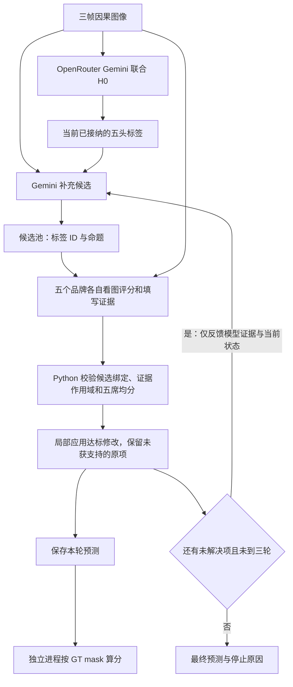

# Verifier / Repair：已试机制与实测结果汇总

整理日期：2026-09-08。依据本地保存的预测、独立审计、费用记录及实验报告核对；本次整理没有新增 API 调用，也没有重新选帧、改阈值或训练模型。

**目前有局部改善，但没有一套修复机制证明了稳定的综合语义收益。** 最新五家模型、12 个 Training 目标、最多三轮实验中，IVT micro-F1 从 17.14% 升至 21.05%，但 IVT 集合 Accuracy 从 8.33% 降至 0；累计新增 2 个正确标签、7 个错误标签。不能只用 F1、模型均分或输出合法率宣布修复成功。

本文件是各轮实验的索引和结论汇总。各头原始计数、F1、集合 Accuracy、修改分类及部分费用审计摘录另见 [可机读指标快照](experiments/verifier_repair_results_20260908.json)。快照的每条摘录保留源 JSON 路径、SHA-256 和 JSON Pointer；数值为 0–1 比例，下面表格为百分比。

## 版本与发布范围

- 整理前，本地和 GitHub `main` 均为 `7a44312477b9415c34c6f307ef943e9f087d9dff`。不能继续把更早的 `25fee94` 当成最新远端提交。
- 历史公开纯 H0 入口仍为 `scripts/run_dataset_api_pipeline.py`，默认配置为 `configs/perception/joint_openrouter_h0.yaml`：Qwen 联合五头 final-only，三帧因果输入，一次 API。它不启用 Verifier、Repair、Tracker 或旧 Gate。该基线是在已测方案中保留的版本，不是已证明的全局最优。
- **最近研究实验的 H0 已改用 OpenRouter Gemini 3.8 Flash。** 实验复用原完整 H0 提示、本体、Schema 和因果图像协议；与历史 Qwen 结果分开记录。换研究模型不等于改动公开默认配置。
- 旧完整 Pipeline 的 Gate 依赖 top-k。final-only 硬标签没有这些分数；独立修复入口通过标签契约接入，没有伪造置信度去调用旧 Gate。
- 本次发布的是本汇总、相关实验报告、指标快照和文档索引。**近期本地研究脚本、其冻结源码、原始请求/回答、数据集图片、Tracker 权重及其他本地改动不包含在本次文档提交中。** 详细报告内的本地复现命令依赖相应脚本和实验目录；仅下载本次文档不能完整重跑所有实验。
- 详细报告中的“未提交/未推送”“当前代码”等文字描述实验结束时的状态。其时间点早于本次文档发布，不能据此判断 GitHub 当前状态。原始实验记录不被本次整理覆盖。

## 如何读结果

每个对照必须使用同一份 H0、同一组目标和对应任务 mask。这里没有把不同视频、模型、样本数的分数排成一个总榜。早期 VID110 六目标来自 Validation；后续修复开发使用 Training，Testing 未用于调参或选方案。开发帧被反复分析的结果不能视作独立泛化验证。

- **F1**：该任务在全部有效目标上的 pooled micro-F1，不是逐帧 F1 的平均，也不是审核模型给的 1–5 分。
- **集合 Accuracy**：该头预测集合与 GT 集合完全相同的比例。
- **改善 / 改坏**：相对同帧 H0，任务集合对称差减少 / 增加；同帧有改善头也有改坏头单列“混合”。改善可能只是少错一个标签，并非整帧全对。
- **无收益替换**：标签变了，但集合对称差没有减少；缺失 GT 的替换另记“不可评分”，不能当作无收益或错误。
- **全部保留 H0**：仅表示没有接纳修改，不证明 H0 正确，也不算修复成功。
- **最多三轮**与**实际三轮**不同；提前停止后延用的预测快照不算新一轮 API 审核。

## 已试机制、对照与结果

表中 IVT 均为 **micro-F1 / 集合 Accuracy（%）**；箭头只比较该行自己的 H0 和修复结果。A 指逐项审核后整份接纳，B 指从 H0 应用通过审核的局部修改；早期有歧义的审核与后来的中性存在性审核不是同一个版本。

| 机制 | 实际范围与对照 | 实测结果与限制 | 详细记录 |
|---|---|---|---|
| 接触区域定位、裁剪提案、双假设复核 | Qwen；Validation VID110 六目标；H0 → 盲定位 → H1 → H0/H1 视觉择优 | IVT **0 / 0 → 0 / 0**；Verb F1 34.78 → 43.48。接纳 2 次：部分改善 1、无收益 1。投影闭包 4/6 → 6/6，没有 IVT 收益 | [原始实验](GROUNDED_CONTACT_REPAIR_SMOKE_2026-09-05.md)、[边界修复与离线回放](VERIFIER_REPAIR_CHECKED_BOUNDARY_2026-09-06.md) |
| 同一 grounded 链路换 Gemini | 先做 8 个 Training 工程目标，再补 4 个五头完整目标；总计 40 次调用 | 前 8 个 V/T/IVT 无 GT，只能证明工程跑通。完整 4 个 IVT **42.86 / 0 → 42.86 / 0**；Target F1 不变而 Accuracy 50 → 25。部分减错 1、改坏 1 | [Gemini 端到端](GEMINI_GROUNDED_E2E_2026-09-06.md) |
| 逐修改审核 A / 局部修改 B，初版 | 复用上述 4 个目标；Qwen 实际只审核 2 个，其他回退；另有 Gemini 超时探针 | 仅实际审核的 2 个：IVT H0 **75 / 0**，A **66.67 / 0**，B **50 / 0**；A 改坏 1，B 改坏 2。`CONTRADICTED` 对“标签不存在”还是“拒绝删除”的解释不一致 | [初版试验](DIFF_REVIEW_TRIAL_2026-09-07.md)、[小测](DIFF_REVIEW_SMALL_TEST_2026-09-07.md)、[Qwen 有效子集](DIFF_REVIEW_QWEN_DIRECT_TEST_2026-09-07.md) |
| 中性存在性审核 A / B | 24 个新 Training 目标；先回答 PRESENT / ABSENT / UNCLEAR，再由程序映射新增与删除；共享 H0、定位、候选、旧审核 | H0 **26.83 / 8.33**；未经审核候选策略 **34.15 / 20.83**；旧修复 **26.83 / 12.50**；A **26.83 / 8.33**，24 个均保留；B **25.32 / 8.33**。候选有潜在收益，但审核未实现净收益 | [24 目标完整对照](PRESENCE_REVIEW_RESULTS_2026-09-07.md) |
| 放宽 observation 长度 | 对相同 24 目标的已保存回答离线回放；后续上限改为 1000 字符；不重新调用模型 | 300 字符限制使新审核 13/16 份失败；放宽能恢复结构有效性。长度回放 A 的 IVT 不变，B **25.00 / 8.33**，仍低于 H0；不是语义问题已解决。离线放宽本身新增调用和费用均为 0 | [长度回放与结果](PRESENCE_REVIEW_RESULTS_2026-09-07.md)、[1000 字符边界](SURGREFLECT_VERIFICATION_AND_RAG_2026-09-07.md) |
| 标签名称化、单命题拆分审核 | 16 个新 Training 目标；I/P 有效 16，其余 15；比较数字 ID、名称和每个命题独立请求 | H0 IVT **44.44 / 20.00**。数字 B **49.12 / 13.33**；名称 B **45.61 / 20.00**；拆分 B **40.00 / 13.33**。F1 局部上升伴随改坏/集合准确率下降，没有方案通过预定筛选 | [开发对照总报告](VERIFIER_DEVELOPMENT_AND_CONFIRMATION_2026-09-07.md) |
| 条件追加历史图像 / 同图再问 | 同一 16 目标；对未解决项补两张真实更早图片，与相同输入重复审核对照，共新增 18 次请求 | H0 IVT **44.44 / 20.00**；重复审核 B 和历史图像 B 都为 **45.61 / 13.33**。未证明增加历史优于同图重复；这不是完整的流式记忆系统 | [时序机制与结果](VERIFIER_DEVELOPMENT_AND_CONFIRMATION_2026-09-07.md)、[协议](VERIFIER_TEMPORAL_EVIDENCE_PROTOCOL_2026-09-07.md) |
| Training 先验扩池 + 三席审核 | 8 个新 Training 目标；I/P 有效 8，其余 7；整视频留出先验，有/无先验共享 H0；新增至少 2 票，删除需 3 票整帧否定 | IVT **24.00 / 14.29 → 24.00 / 14.29**；先验新增 28 个 IVT 候选，覆盖 H0 漏掉的 10 个真值中的 6 个，但没有修复 IVT。无先验仅补对 1 个器械；有先验全部保留。没有实际第三轮 | [先验实验](H0_PRIOR_PANEL_EXECUTION_2026-09-07.md) |
| 早期五席全本体均分 + LLM 补丁 | 计划 8 个旧 Training 目标，实际发送 6 个，仅 3 个目标首轮五席完整有效；不是后来五个品牌各一席的组合 | 实际发送子集 IVT **31.58 / 20.00 → 31.58 / 20.00**，全部未接纳。存在超长、评分数组长度错、服务失败；没有完整有效第二轮或真实第三轮。属于部分执行的可行性测试 | [全本体均分执行报告](H0_FIVE_MEAN_EXECUTION_2026-09-07.md) |
| 五品牌候选池评分、程序局部接纳 | Grok / Qwen / GPT / Gemini / DeepSeek 各一席；4 个旧 Training 目标，V/T/IVT 仅 3 个有效；实际轮数 2、2、1、1 | IVT **16.67 / 0 → 16.67 / 0**；I F1 93.33 → 100，T F1 **50 → 42.86**。改对 1 个器械，误加 2 个肝脏 Target；真 IVT 6 个仅 1 个进入池。高均分 4.8、4.6 仍误加 | [接口可用性](CANDIDATE_PANEL_PREFLIGHT_2026-09-07.md)、[端到端结果](CANDIDATE_PANEL_END_TO_END_2026-09-07.md) |
| 显式区分“可见组织”和“交互目标” | 固定上述两个已知错例、同图同池；原评分、重复字段诊断、唯一交互分三组，共 30 次请求 | 肝脏均分 4.6、4.0 → 2.2、1.8。数值反事实避免两次误加，Target F1 从旧修复 40 恢复 H0 的 50；没有超过 H0。仅 8/10 证据对象格式有效，不能称为完整五席证据审核成功或泛化结果 | [Target 机制诊断](TARGET_INTERACTION_DIAGNOSIS_2026-09-08.md) |
| 候选绑定证据、作用域校验、冲突否决 | 另 4 个完整 Training 目标；Qwen H0，Gemini 补池；同池对比旧纯数字审核与新证据审核 | H0 IVT **14.29 / 0**；旧/新修复均不变。新审核 Verb F1 **76.92 → 85.71**，Accuracy **25 → 50**，1 个部分改善、3 个不变；Target 不变。前置缺 V/T/IVT GT 的工程目标不混入语义分数 | [语义契约修复](VERIFIER_REPAIR_SEMANTIC_FIX_2026-09-08.md) |
| 盲生成候选、不展示 H0 | 与上行同 4 目标、缓存 H0；仅重做候选与审核，24 次新请求 | 最终指标与新证据审核相同；真 IVT 的候选覆盖反而从 2/8 降到 1/8。盲调用并未解决共同漏检 | [盲候选消融](VERIFIER_REPAIR_SEMANTIC_FIX_2026-09-08.md) |
| 本体补全候选 / 有效证据法定票数 | 同 4 目标；按池中 I/V 枚举合法 IVT/Target；严格五席与至少 4 席有效、至少 3 席同向对照 | 真 IVT 候选覆盖 **2/8 → 6/8**，最终 IVT 仍 **14.29 / 0**。扩池严格版改坏 1 帧；扩池法定票数版改善 1、改坏 2。覆盖率增加没有转成可靠接纳 | [扩池与接纳消融](VERIFIER_REPAIR_CAUSE_AND_ABLATIONS_2026-09-08.md) |
| 再调一次 LLM 联合反思 | 同 4 目标；Gemini 3.8 Flash medium 根据图片、候选和审核证据提出绑定修改 | 2 次 KEEP、2 个合法补丁；IVT **14.29 / 0 → 14.29 / 0**。Instrument F1 76.92 → 85.71，但 Verb 76.92 → 46.15；2 帧有改善也有损害，2 帧不变 | [反思消融](VERIFIER_REPAIR_CAUSE_AND_ABLATIONS_2026-09-08.md) |
| 跨视频带标注参考图 | 两个已分析的目标；检索 5 张其他 Training 视频参考图及其标签/框，排除整个查询视频；2 次 LLM 请求 | 两次 KEEP；该子集 H0 的 Target/IVT F1 均为 0，修复仍为 0。只是很小的参考图试验，不能推出所有 RAG 无效 | [参考图消融](VERIFIER_REPAIR_CAUSE_AND_ABLATIONS_2026-09-08.md) |
| H0 也切换为 OpenRouter Gemini | 复用上述 4 个完整目标；新 H0、候选与五席审核共 28 次调用 | 新 Gemini H0 IVT **13.33 / 0**，审核全部保留。与缓存 Qwen 比较：Target F1 16.67 → 33.33，但 Verb 76.92 → 57.14、Phase 75 → 50；小样本不能证明哪种 H0 普遍更优 | [Gemini H0 对照](OPENROUTER_GEMINI_H0_PANEL_2026-09-08.md) |
| 多一轮原补池 / 稀疏 LLM Repair | 缓存上述 Gemini H0 和首轮；原补池续跑与只返回 changes 的 LLM 修复，共 18 次新调用 | 原续跑新增 1 个正确 Target，T F1 **33.33 → 46.15**，IVT仍 **13.33 / 0**；实际轮数 2、2、1、1。稀疏 LLM 4 次均返回空补丁，未触发后续五席审核，其非空路径只有离线验证 | [第二轮与稀疏补丁](SECOND_ROUND_LLM_DELTA_REPAIR_2026-09-08.md) |
| 较新五品牌模型、4 分均分、最多三轮 | 12 个新 Training 目标，五头均有效；11 个实际三轮，1 个空池只有一轮；3.5 为共享轨迹离线影子对照 | IVT **17.14 / 8.33 → 21.05 / 0**；T **50 / 41.67 → 47.06 / 33.33**。主流程改善 1、改坏 4、不变 7，累计新增标签 2 对 7 错；第三轮只增加错误。没有通过模型均分证明正确性 | [最新 12 目标逐轮实验](RECENT_FIVE_PANEL_THREE_ROUNDS_2026-09-08.md) |

## 最新链路具体做了什么

GT 评分结果不进入下一轮请求。Repair 已使用 LLM 生成候选或提出补丁，但“把哪些改动写入结果”由程序接纳规则决定；不是 Python 凭空补标签，也不是让某个模型的自评直接充当 GT。

最新五席为：Grok `grok-4.6`、Qwen `qwen3.8-flash`、GPT `openai/gpt-5.6-luna`、Gemini `google/gemini-3.5-flash-lite`、DeepSeek `deepseek/deepseek-v4-flash-vision-exp`。这是本次请求记录中的实际型号，不能保证以后仍可用。Grok 是明确的旗舰例外，本实验不能称为“五个轻量模型”；通道和推理设置见详细报告。

主流程新增阈值 ≥4、删除阈值 ≤2；五席任一证据无效则该项不能计算均分。新增 IVT 还要求其 I/V/T 组件得到支持；删除 IVT 不自动删除三个独立头。Phase 保持 H0。这个版本记录正反分歧，但不再让分歧单独否决已经达标的均分。

3.5 对照复用主流程候选和回答，仅离线变更接纳阈值；由于五个整数分均值每档相差 0.2，实际新增界限为 ≥3.6，删除界限为 ≤2.4。它不是第二套独立闭环，不能据此估计独立运行 3.5 阈值会产生什么候选。

### 最新逐头结果

所有单元格为 **micro-F1 / 集合 Accuracy（%）**，每头有效目标数均为 12。

| 结果 | Instrument | Verb | Target | IVT | Phase |
|---|---:|---:|---:|---:|---:|
| H0 | 88.24 / 75.00 | 45.71 / 33.33 | 50.00 / 41.67 | 17.14 / 8.33 | 83.33 / 83.33 |
| 4 分，第 1 轮 | 88.24 / 75.00 | 44.44 / 33.33 | 50.00 / 41.67 | 17.14 / 8.33 | 83.33 / 83.33 |
| 4 分，第 2 轮 | 88.24 / 75.00 | 46.15 / 25.00 | 48.48 / 33.33 | 21.62 / 8.33 | 83.33 / 83.33 |
| 4 分，第 3 轮 | 88.24 / 75.00 | 46.15 / 25.00 | 47.06 / 33.33 | 21.05 / 0.00 | 83.33 / 83.33 |
| 3.5 分，第 3 轮影子对照 | 88.24 / 75.00 | 46.15 / 16.67 | 47.06 / 25.00 | 21.05 / 0.00 | 83.33 / 83.33 |

| 相对 H0 | 改善帧 | 改坏帧 | 混合帧 | 无收益替换 | 不变 | 从错到五头全对 |
|---|---:|---:|---:|---:|---:|---:|
| 4 分 R1 | 0 | 1 | 0 | 0 | 11 | 0 |
| 4 分 R2 | 1 | 4 | 0 | 0 | 7 | 0 |
| 4 分 R3 | 1 | 4 | 0 | 0 | 7 | 0 |
| 3.5 分 R3 | 2 | 5 | 1 | 0 | 4 | 0 |

第三轮的正确 IVT 候选覆盖仍为 10/19，比第二轮没有增加。第三轮有效均分 ≥4 的 5 个 IVT 命题全部为 GT 假阳性；10 个池内正确 IVT 中，8 个因至少一席证据无效不能均分，另 2 个处于不确定区间。这是池中命题的诊断，不能误写成“新增了五个错误 IVT”。

## 费用与实际执行量

以下按各报告的新增执行范围列账，不跨行求总和；共享 H0、历史累计账本和离线回放尤其不能重复计费。美元原生账单、人民币 token 估价、未确认费用预留分别记录。费用低不代表方案有效，预留也不等于已扣费。

| 实验范围 | 实际新增 POST | 已知原生美元费用 | 其他费用或边界 |
|---|---:|---:|---|
| Qwen grounded 六目标原实验 | 20 | $0.243062 | 含 H0；修复新增 14 次 / $0.163898；之后离线边界回放为 0 次 / $0 |
| Gemini grounded 两批共 12 目标 | 40 | $0.13957350 | 含 H0；修复新增 28 次 / $0.09833100 |
| 初版 A/B 的 Qwen 局部测试 | 3 | $0.041436 | 2 次有效审核、1 次 Schema 400 未定价；此前 Gemini 超时探针另记 |
| 24 目标中性存在性对照 | 104 | $1.342372 | 1 次提案 400 未定价；长度回放未新增调用 |
| 16 目标名称化、拆分、时序开发合计 | 136 | $2.063434 | 包含共享收集和各消融；不能再重复加每个子实验费用 |
| Training 先验与三席对照，含兼容性检查 | 74 | $0.84638986 | 另有 $2.5467968 未确认预留 |
| 早期全本体五席，含失败尝试 | 49 | $0.185653578 | 另有 $8.1509552 未确认预留；不能把预算占用当实际消费 |
| 五品牌候选池端到端，含预检与失败 | 46 | $0.19999910 | Qwen token 估价 ¥0.021608；1 次 404、4 次 400 无费用信息 |
| 两个 Target 错例的三组诊断 | 30 | $0.04408646 | Qwen token 估价 ¥0.042652 |
| 证据语义修复，含工程试验、完整 GT 对照与盲候选 | 165 | $0.44568374 | token 估价 ¥0.243952；另 $0.0241336 未确认预留；其中完整 GT 主对照 48 次、盲候选 24 次 |
| 扩池 / 联合反思 / 参考图 | 26 | $0.20963182 | token 估价 ¥0.131162；共享此前 H0 |
| Gemini H0 切换与五席审核 | 28 | $0.06931329 | token 估价 ¥0.037719 |
| 第二轮原补池与稀疏 LLM Repair | 18 | $0.08643974 | token 估价 ¥0.023022；没有新 H0 |
| 最新 12 目标最多三轮，含首次格式失败 | 217 | $0.826984100 | token 估价 ¥0.328012；另 ¥0.143859 未确认预留；复用 6 份逐字请求相同的成功回答 |
| 本次文档整理与发布 | **0** | **$0** | 不启动新模型实验 |

最新 217 次中，216 次 HTTP 200、1 次 Qwen 400；215 份可解析 JSON、1 份 HTTP 200 不能解析。有效 JSON 仍可能存在证据字段错误或视觉误判，不能拿 215/217 当模型准确率。

## 已修问题、仍在的问题与未验证方向

**工程问题已经有可复现修正。** 包括按集合判断而非数组顺序触发修复、聚合候选再次校验 final-only 上限、中性标签存在性避免删除歧义、候选 ID 绑定、共享组件保护、任务 mask 算分、接口 Schema 适配、空池不能算通过。相关历史报告分别记录单元/接口测试结果；它们证明代码边界，不能替代视觉准确率实验。

最新实验的空 H0/空候选目标曾被原代码标为 `MODEL_PASS`。审计将其记录为 `EMPTY_POOL_UNVERIFIED`；付费结束后才增加跳过五次空审核及空池拒判保护。原预测不变，该保护只有离线验证，不能把它写成本轮付费语义增益。11 个目标实际三轮，另 1 个仅一轮；后两轮的全样本算分沿用该目标已有结果。

**语义问题仍同时存在于三个环节。** 候选没有找全正确的动作关系；审核模型对可见组织、实际交互对象和间接受力的类别边界理解不一致，也会直接看错组织/动作；接纳规则既挡住证据格式无效的正确项，又放行高均分的错误项。反复投票会相关地重复这些错误，没有依据把五个品牌或三轮当成相互独立的证据。

**论文思路的借鉴程度需要如实标注。** 本项目已尝试具体命题核查、尽量保留原答案的局部修改、短历史证据、Training 先验、一次联合反思和跨视频参考图。这些是项目适配实验，不是对 SurgReflect、CoVe、RARR 或流式视频论文完整方法的复现。方法来源与机制比较见 [论文方法与反思分析](VERIFIER_PAPER_METHODS_AND_REFLECTION_2026-09-07.md) 和 [SurgReflect / RAG 分析](SURGREFLECT_VERIFICATION_AND_RAG_2026-09-07.md)。

Tracker OOF 用于接触裁剪替代、完整长视频记忆、图检索 RAG，以及独立闭环的 3.5 阈值对照，尚无本汇总所覆盖的语义收益实测。OOF 文件准备完成也不等于其已参与这些 Verifier 实验。

当前决定是保留冻结 H0 作为主实验基线，保留研究代码与失败记录，不把目前五席三轮方案升为默认。若继续研究，下一项应在新 Training 样本上单独验证审核输出契约与候选覆盖，随后再作独立确认；不能从已反复查看的帧中选“最好的一轮”报告，也没有证据支持直接增加第四轮。
