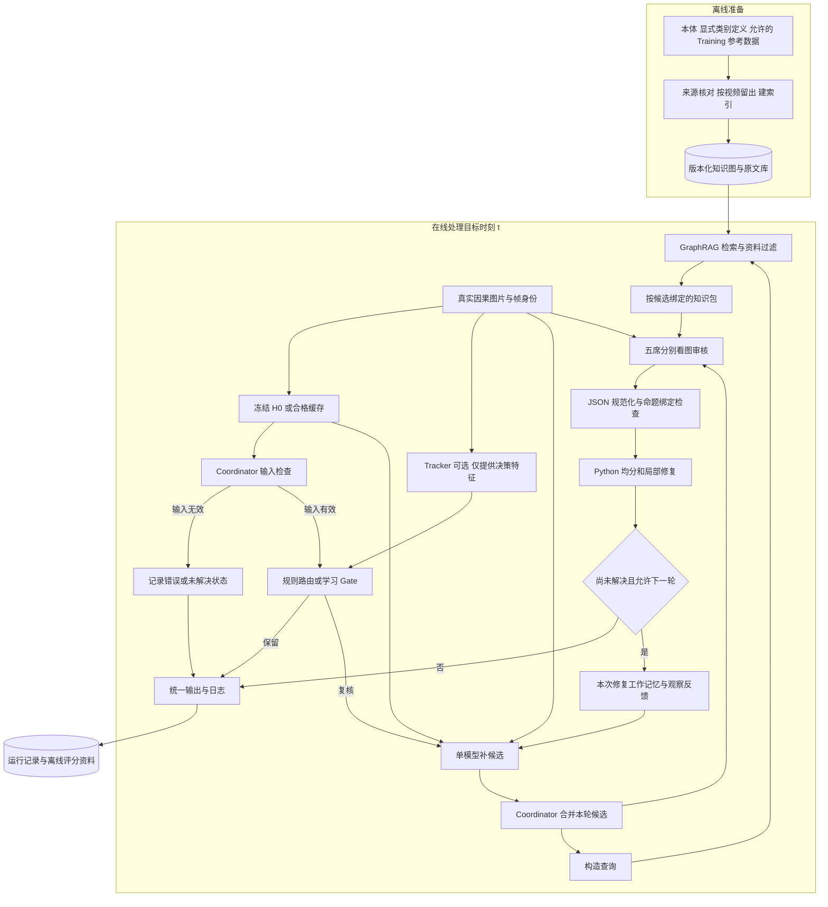

# Final-only Pipeline 加入 GraphRAG 的项目架构

日期：2026-09-08。核对代码版本：`517a89a2982ec6b6819397f35b2d41bbdf84da98`。
状态：**架构提案，尚未实现、运行付费实验或证明指标提升。**

本设计把 GraphRAG 定义为 **Coordinator 调用、Verifier 使用的知识检索服务**。首版主接点固定为：**Gate 决定复核 → 单模型补候选 → 合并候选池 → GraphRAG 查资料 → 五席看图审核 → Python 局部修复**。它不直接修改标签，不给五席增加第六票。

本文是对[位置分析与最小对照](../GRAPH_RAG_VERIFIER_DESIGN_2026-09-08.md)的项目级细化。它描述独立 final-only 研究链路的集成方案，不替代既有 [ranked Pipeline 架构](Streaming_Surgical_Final_Pipeline_Architecture_and_Pseudocode.md)或 [Tracker × Gate 正式协议](CANONICAL_PIPELINE_TRACKER_GATE_SPEC_2026-09-03.md)。两种架构的 H0、候选池和审核范围不同，正式落地必须建立独立版本契约，不能移除旧兼容性检查后冒称已完成迁移。

## 1. 架构决策与目的

| 决策 | 明确位置和作用 | 原因 |
|---|---|---|
| H0 保持冻结 | 只接原三帧或真实短历史，也可读已验收的同请求缓存 | 朋友正在跑的多模型初始预测可单独验收；此次检索不改变初始预测 |
| Gate 在补候选和检索之前 | 根据 H0 与可用的决策特征选择保留或复核 | 路由不能偷看已经付费获得的审核结果；直接保留分支不做无用检索 |
| GraphRAG 首次查询在候选合并之后 | Coordinator 为每个候选查询定义、区别说明和来源 | 当前问题包括正确候选已存在却被否定，需要先验证审核是否受益 |
| 知识包交给 Verifier | 五席各自结合资料和当前图片判断 | 数据库检索相关性不等于当前帧存在性 |
| Repair 保持确定性 | 使用五席的有效判断执行局部增删 | 首个对照只改变审核所见资料，不同时改接纳规则 |
| 训练统计、案例、历史证据分层 | 作为后续独立开关保留接口 | 不把定义、频率、额外图片、更多轮数的作用混在一次对照 |

要解决的是“审核是否正确理解这条命题及类别区别”。单纯文字检索无法保证解决工具尖端看不清、组织遮挡或时间采样不足。现有 prompt 已有完整本体和部分说明；若找不到超出它的可靠资料，不应为图结构本身继续付费。

## 2. 完整项目图：离线建库与在线推理分开

下面是**拟集成的目标架构**。当前已发布的是 H0、提案、五席审核和修复研究代码；图检索及 final-only Tracker/Gate 全链路接线尚未完成。



首个 GraphRAG 对照统一一轮、全部预定目标复核，用于隔离审核层的效果；此时 Gate 是显式的研究路由，不宣称已训练好。后续完整 Pipeline 才接学习 Gate。多轮模式若启用，每轮合并后再次查询该轮候选，已有内容可按精确缓存键复用。

这里的 Tracker 只进入 H0 后的决策侧，不改变三帧、不进入检索排序或五席评分。这样四组可以共享 H0，且同一帧被触发时使用相同修复机制。Tracker 框辅助检索或审核属于另一个后续变量，不包含在首版。

## 3. 每个模块负责什么

| 模块 | 输入 | 输出 | 拥有的权限 |
|---|---|---|---|
| 因果输入／H0 | 真实图片、原视频帧号、固定模型与模板 | 五头最终标签、输入哈希、原始回复与失败记录 | 生成初始标签；不产生虚构 confidence |
| Tracker／决策特征 | 目标时刻可用的预测框与轨迹，或明确关闭／失败状态 | 有状态标记的定位与器械分歧特征 | 帮助判断是否值得复核；不提供动作或组织真值 |
| Coordinator／Gate | 有效 H0、复核前特征、运行预算 | 保留或进入一次有上限的修复过程 | 决定何时调用；不把低统计频率当硬错误 |
| 候选生成 | 原图、当前预测、原有池、允许的反馈 | 额外 I／V／T／IVT 候选 | 提议，不直接发布标签；首版不接 GraphRAG |
| GraphEvidenceService | 候选命题、来源范围、知识版本、可选问题线索 | 逐候选知识包、来源路径、未命中与排除原因 | 检索和组织资料；不判当前存在性，不赋评分 |
| 五席 Verifier | 当前三帧、完整候选、知识包 | 原有逐项评分、finding、scope、图片引用与 observation | 给出可被质疑的视觉判断；互相不看评分 |
| Repair／Finalizer | 当前标签、五席有效结果、固定规则 | 修改后的五头、逐项决策、退出原因 | 唯一执行标签增删与最终落盘的模块 |
| 工作记忆／日志 | 当前目标的候选、资料哈希、原始回复和决策 | 后续轮反馈、可审计轨迹 | 记录模型意见；不能把它写成可信库事实 |

输入有效性检查只按明确的 final-only 契约处理字段、ID、图片和身份。独立 I/V/T 与 IVT 投影的差异可作诊断，但本设计不新增“强制把五头闭包重建”的规则；罕见关系也不作为硬拒绝依据。

## 4. GraphRAG 内部到底做什么

首版是小型领域图检索，不要求部署 Microsoft 完整 GraphRAG 系统。以现有固定本体为种子，用 JSON 或 SQLite 保存关系、原文和来源索引，Python 实现确定性检索；五席模型承担“利用资料生成判断”的部分。

```text
候选 ID 解析
→ 进入完整 IVT／独立类别节点
→ 沿定义、组件、类别对照关系走 1–2 跳
→ 找回相关原文条目
→ 按来源范围、版本、视频留出与时间过滤
→ 确定性排序、去重、按候选分配文本预算
→ 输出有出处的知识包
```

建库阶段也必须执行来源隔离：不能先用目标视频生成社区摘要、类别解释或 embedding，再只在返回结果时隐藏视频 ID。首版不在线调用 LLM 写查询、重排或总结，避免无意增加另一条反思链。

若以后启用 GT 统计或参考案例，并做按视频／fold 的 Gate 评估，排除集合还须包含该评估 fold 的全部留出视频。这个限制同时作用于 Gate 训练行所用修复记录的知识库，覆盖统计、案例、摘要、embedding 和重排训练；不能只在评估查询时排除自身。manifest 绑定 `outer_evaluation_video_ids` 与每条查询的视频排除并集。只有完全不依赖数据集视频的外部定义库可以跨 fold 共用。若 Tracker 等其他上游仍使用不同留出范围，只能报告 Gate 层验证，不能宣称整个系统完成嵌套 OOF。

查询覆盖全部预定候选，包括高分可能判错的候选和独立 I/V/T；不只查询 `UNCLEAR`。候选池成员资格本身不是支持证据。第一版不借预测 Phase 硬裁其他类别；候选缺少可靠资料时返回空包，该项继续按无检索审核策略判断。

排序首先看命题直接关联、类别对照关系、可追溯原文和路径长度。排名表示“与问题相关”，不叫“当前存在概率”。第一版无 GT 共现频率加分；相同条目跨候选引用时共享存储，同时保留候选绑定。

首个对照拟固定一至两跳、每个候选最多 3 个条目、每帧最多 12 个去重条目，新增知识正文最多 6000 字符。先按候选轮流分配直接定义，再分配区别说明；同一个条目可以支持多项查询。超过预算时舍弃完整的低优先级条目并记录原因，不截断关键限定语、不删除待审核候选。实际输入 token 按各提供商记账，字符上限不是 token 或美元承诺；普通检索使用同样上限。

### 图的节点与边

| 数据层 | 节点与边 | 首版处理 |
|---|---|---|
| 本体／定义层 | IVT、Instrument、Verb、Target、Phase、Definition、Source；`HAS_COMPONENT`、`DEFINED_BY`、`DISTINGUISHED_FROM`、`SOURCED_FROM` | 启用；定义新增前核对来源，项目解释与官方定义明确区分 |
| 统计层 | Statistic 连接完整 IVT 与 Phase 条件，附分母、视频数、任务有效性、来源集合 | 保存设计接口，首版不送入五席 prompt |
| 参考案例层 | ReferenceClip／Frame 连接有有效 GT 的 IVT 和 MediaRef | 后续单独测；目标视频排除；不把参考图编号冒充当前图 |
| 当前视频证据层 | CurrentFrame、ObservedTrack、ModelClaim、Observation；附时间、水位和来源 | 首版只用原三帧；扩展历史另测，并限制在真实已处理的因果前缀 |
| 当前修复工作区 | Episode、Round、Candidate、Review、Decision、EvidencePacket | 可追踪上下文；与可信知识图隔离，不自动晋升事实 |

完整 IVT 是一个整体节点。例如本体里的 `ivt_19=(instrument_0,verb_1,target_8)`，即 `grasper/retract/liver`，与 `ivt_9=(0,0,8)` 即 `grasper/grasp/liver` 是两个不同命题。它们可以沿共有组件找到对照说明，但不能因若干两两关系常见就拼出“当前存在”的结论。名称相同也不能把两把器械合并成一个实例。

每条定义和图边保存来源定位、内容哈希、版本、来源性质以及允许的数据范围。一个节点合法、一条引用真实，只说明资料可追溯，不证明模型对当前图的解释正确。

## 5. 输入与输出接口

以下 JSON 是**设计示例**，不是已存在 API、实际目标或已建好的库；`demo_` 版本只用于说明。真实版本必须使用内容哈希、完整候选集合和经过验证的帧身份。

### Coordinator → GraphRAG

```json
{
  "schema_version": "graph_review_query_v1_proposed",
  "example_only": true,
  "request_id": "demo_query_1",
  "consumer": "visual_verifier",
  "mode": "definition_and_boundary",
  "target": {
    "video_id": "DEMO_ONLY",
    "frame_id": 101,
    "causal_frame_ids": [51, 76, 101]
  },
  "candidate_pool_version": "demo_pool_1",
  "candidates": [
    {"candidate_id": "instrument_0", "task": "instrument", "label_id": 0},
    {"candidate_id": "verb_1", "task": "verb", "label_id": 1},
    {"candidate_id": "target_8", "task": "target", "label_id": 8},
    {"candidate_id": "ivt_19", "task": "ivt", "label_id": 19,
     "components": {"instrument": 0, "verb": 1, "target": 8}}
  ],
  "review_observations": [],
  "policy": {
    "knowledge_version": "demo_kb_1",
    "allowed_layers": ["ontology", "verified_definition"],
    "exclude_video_ids": ["DEMO_ONLY"],
    "max_current_video_frame_id": 101,
    "max_hops": 2,
    "max_items_per_candidate": 3,
    "max_unique_items_per_frame": 12,
    "max_knowledge_text_chars": 6000,
    "include_frequencies": false,
    "include_reference_images": false
  }
}
```

例子只包含一个 IVT 及其组件，真实查询包含本轮完整池。后续若启用“审核后定向查证”，`review_observations` 可放已通过绑定检查的意见和出处，但必须标明 `MODEL_CLAIM`；提问应允许相反解释，不能把模型结论先写成查询事实。

### GraphRAG → Verifier 输入构造器

```json
{
  "schema_version": "graph_review_evidence_v1_proposed",
  "example_only": true,
  "request_id": "demo_query_1",
  "candidate_pool_version": "demo_pool_1",
  "knowledge_version": "demo_kb_1",
  "status": "NO_ADDITIONAL_VERIFIED_KNOWLEDGE",
  "items": [],
  "by_candidate": {
    "instrument_0": {"item_ids": [], "missing": "additional_sourced_definition"},
    "verb_1": {"item_ids": [], "missing": "additional_sourced_boundary"},
    "target_8": {"item_ids": [], "missing": "additional_sourced_boundary"},
    "ivt_19": {"item_ids": [], "missing": "additional_sourced_relation_definition"}
  },
  "diagnostics": {
    "changes_candidate_pool": false,
    "establishes_current_presence": false,
    "fallback": "EXISTING_VISUAL_REVIEW"
  }
}
```

这个空包有意表达当前关键依赖：可靠的新增语料尚未准备完成。不能为了示例编一条官方标注规则或统计数字。命中时每个 `items` 条目至少有 `item_id / kind / text / source_id / source_locator / source_hash / graph_path / already_in_baseline_context`。`by_candidate` 只引用已有条目。没有 `accept`、没有存在性评分、没有代替五席的投票。

### Verifier → Repair

第一版审核输出完全沿用当前模型契约：按候选 ID 返回 `rating`、`finding`、`scope`、`image_indices`、`observation`。图片引用仍指当前三帧；检索资料来源放在独立请求日志，不能混进 `image_indices`。当前学术医疗视频说明保留在模型输入开头。

当前图片数契约为 1–3 张，明确判断需引用目标图，整帧删除需 `WHOLE_FRAME`；每项 observation 上限为 1000 字符。以后增加参考图或更长历史，必须另设 `reference_media`／`historical_media` 角色和对应 Schema，不能直接追加到旧数组、使“最后一张为目标图”的含义变化。

新请求构造器在原五席输入旁加入 `reference_knowledge`，保留原图、本体、候选和评分规则。五席分别调用，互不看其他席答案。资料中如包含指令文字，只作为被引用的来源内容处理，不能改变审核任务或模型契约。

Repair 继续调用当前 `recent_mean_panel.aggregate/select/unresolved`。全部五席有效才计算候选均分；≥4 支持新增，≤2 支持删除；新 IVT 还需要三个组件分别通过。独立 I/V/T 也能按规则增删，删除组件不能破坏保留 IVT；Phase 保持 H0。GraphRAG 的相关度、频率与引用条数都不进入均分。

## 6. 多轮、Memory 与第二个检索位置

首个对照统一只跑一轮；完整版可以在固定上限内使用原观察反馈链路。每轮先冻结当轮池和知识包，再发五席请求，结束后保存结果；不能拿不同轮的最高分拼成一次审核。

完整多轮模式的原生默认上限需在实施时冻结。已有观察反馈实验最多两轮，旧均分实验最多三轮，二者不可混写成“已验证的三轮反馈方案”。设计上优先验证两轮上限，只有预定未解决条件才进入第二轮，不承诺第二轮有收益。

第二个可选接点是“首轮审核后，依据具体问题再次查库”。它与主接点使用同一个库，但有不同输入和消费者：

| 模式 | 查什么 | 给谁使用 | 如何控制变量 |
|---|---|---|---|
| 首版 `definition_and_boundary` | 全部候选的定义和区别 | 首轮五席 | 固定候选、图像与接纳规则 |
| 后续 `issue_specific_review` | 初审观察中涉及的具体类别分歧 | 再次五席复核 | 固定候选、原图，并与同调用数的无检索再审比较 |
| 后续 `candidate_suggestion` | 可能遗漏的完整 IVT／案例 | 单提案模型 | 单独评估候选覆盖与最后收益；不能算只改 Verifier |
| 后续 `causal_media_lookup` | 已处理过去帧或参考片段 | 明确支持这些图片角色的视觉复核 | 与相同图片数、相同时间范围的普通采样比较 |

首版只启用第一行，其余是扩展接口。仅把本轮观察记录到工作记忆，不启用自动累计的跨窗口语义事实库。若以后开放历史图，读取在目标时刻冻结的快照，新模型意见在本帧输出后写入独立运行图，不能回流成当次查证依据；历史 `MODEL_PASS` 仍然只是模型状态。

## 7. 端到端伪代码

下面是拟实现逻辑，函数名除标注的现有核心外均为接口设计，不能当成已存在入口。

```python
def process_target(target, policy, graph_snapshot):
    images = load_real_causal_images(target)     # 不读取未来；保持 H0 原输入
    image_count = len(images)
    h0 = validated_h0_cache_or_predict(images, policy.h0_version)
    if not valid_final_only_input(h0, target):
        return finalize_execution_failure(target)  # 不伪造空 H0 进入修复

    tracks = causal_tracker_or_explicit_mask(target, policy.tracker)
    route = decide_before_review(h0, tracks, policy.gate)
    if route == "KEEP":
        return finalize(h0, repair_attempted=False)

    current = h0
    pool = make_pool(h0)                        # 现有核心
    issues, feedback = [], None
    for round_id in range(1, policy.max_rounds + 1):
        proposal = existing_visual_proposer(images, current, pool, issues, feedback)
        if proposal.execution_failed:
            return finalize_recorded_fallback(h0, current, proposal.error)
        pool = make_pool(current, proposal.labels, pool)
        if not pool["propositions"]:
            return finalize_unverified(current, reason="EMPTY_POOL_UNVERIFIED")
        query = build_graph_query(pool, target, policy.knowledge_policy)
        evidence = graph_snapshot.retrieve(query)  # 无命中返回显式空包
        validate_candidate_binding_and_sources(evidence, query)
        freeze_round_inputs(images, pool, evidence)

        raw_reviews = five_existing_visual_reviewers(images, pool, evidence)
        reviews = normalize_existing_contract(raw_reviews, pool)
        means, diagnostics = aggregate(reviews, pool, image_count=image_count)
        next_state = select(current, pool, means, threshold=4.0)
        issues = unresolved(next_state, pool, means, diagnostics, threshold=4.0)
        save_round_and_costs(current, next_state, pool, evidence, raw_reviews, issues)
        current = next_state
        if not issues:
            break                              # 仅表示池内达到模型规则
        feedback = build_review_feedback(pool, reviews, issues, image_count=image_count)

    return finalize(current, repair_attempted=True, unresolved=issues)
```

实现时失败回退必须从既有运行策略提取并冻结，不能用伪代码略写掩盖差异：首轮失败回到合法 H0；已完成前轮的后续失败如何保留已完成结果，要与研究对照一致并显式记录。无效席不补票、不重采到满意、没有平均分不代表 0 分。预算耗尽、输入失败、模型拒绝和语义反驳分别记录。

所有付费包装函数必须经过同一预算管理器，在每次 POST 前按账户原子预留并在返回后结算，包括并发五席和失败请求。图检索不绕过原 API 账本。首版单臂部署每个复核目标是一份提案加五份审核，缺 H0 时另加一次；本地图查询没有额外模型调用，新增知识的输入 token、建库和检索耗时单独统计。

检索库暂时不可用或某资料越界时，剔除不可用资料、记录原因，使用无检索输入继续原审核；候选池哈希错配等程序错误应阻断该知识包，不能将错候选的资料带入模型。出现异常不得绕过五席接纳条件。

## 8. 映射到当前代码与拟新增文件

| 位置 | 当前实际文件／接口 | 拟改动 |
|---|---|---|
| H0 契约 | [main_h0.py](../../src/surgical_agent/perception/main_h0.py)、[final_only.py](../../src/surgical_agent/perception/final_only.py) | 不改预测机制；新适配器校验合格缓存与完整身份 |
| 候选 | [gemini_proposal](../../scripts/run_semantic_candidate_trial.py)、[make_pool](../../src/surgical_agent/research/verification/candidate_coordinator.py) | 首版复用；不能把旧 `candidate_coordinator.select` 当成最新接纳器 |
| 当轮接点 | [run_evidence_feedback_trial.py](../../scripts/run_evidence_feedback_trial.py) 中展开候选后、构建五席请求前 | 新研究入口在这里取知识包；旧冻结 runner 保留 |
| 五席输入 | [run_recent_mean_panel_trial.py](../../scripts/run_recent_mean_panel_trial.py) 的 `review_wire` | 新 wrapper 增加知识输入，不改历史函数语义 |
| 审核／修复 | [review_normalization.py](../../src/surgical_agent/research/verification/review_normalization.py)、[recent_mean_panel.py](../../src/surgical_agent/research/verification/recent_mean_panel.py) | 首版复用并验证输出一致性 |
| 观察反馈 | [review_feedback.py](../../src/surgical_agent/research/verification/review_feedback.py) | 首版单轮不改变它；后续轮仍只传合格的原始意见 |
| 完整 factory | [final_pipeline_factory.py](../../src/surgical_agent/systems/final_pipeline_factory.py) 当前拒绝 final-only | 保留拒绝，新增独立 final-only 集成配置与入口 |

拟新增的代码布局如下，**当前没有创建这些运行模块**：

```text
src/surgical_agent/research/retrieval/
    contracts.py          # Query / EvidencePacket / SourceRef
    build_graph.py        # 来源核对、留出、节点与边
    graph_store.py        # 版本化 JSON 或 SQLite
    retrieve.py           # 定义／对照的一至两跳查询
    source_policy.py      # 视频隔离、时间与资料性质
    review_context.py     # 转换为五席的 reference_knowledge
scripts/run_graph_review_trial.py     # 独立机制对照入口
scripts/run_final_only_graph_pipeline.py  # 后续完整模块接线入口
```

每份运行 manifest 绑定 H0／候选／审核／接纳策略、知识库、语料、图结构、检索算法、留出清单及实际模型路由哈希。查询缓存键包含目标视频、因果截止、候选池、知识版本和策略；相同文字但不同允许来源范围不能误命中同一缓存。

## 9. 学术依据与本项目的改动

| 来源 | 已核对的方法 | 借鉴到哪里 | 本项目额外限制 |
|---|---|---|---|
| SurgReflect，用户 PDF 第 5–6 页 | 数据集先验记忆辅助候选扩充与阶段一致性；样本记忆保存预测、候选、问题 | 共享库由 Coordinator 调用；工作记忆与参考知识分开 | 冻结 H0；不直接复制其候选/Phase 统计接纳方式 |
| Microsoft GraphRAG／Local Search | 根据查询实体组织图关系与原文上下文，再交给模型生成 | 候选 ID 作为明确实体入口，返回关联定义与来源 | 精细帧级审核不用整库社区总结；第一版无在线 LLM 查库调用 |
| Vgent | 视频图检索后，用结构化问题筛选资料，再让模型看筛出的真实片段 | 保留原始证据引用，检查资料适用性；为以后因果片段检索预留接口 | 不能直接使用全视频离线图；额外图片、检索筛选调用均需单独计费和对照 |
| CRITIC | 使用外部工具反馈支持检查和修订 | 用外部资料补充模型判断，而不是只重复自己的意见 | 借鉴工具反馈原则；不把其语言任务结果当成手术视觉收益 |

SurgReflect 公开代码中，初始联合预测和模型修复能接收先验提示，但 `IVTVerifyExpert` 本身主要接收原图、候选和兼容规则。把检索定义直接交给当前五席是本项目新适配，不声称母体已经采用同样审核输入。[作者专家代码](https://github.com/AlexZhihao/SurgReflect-Hierarchical-Agentic-Verification-for-Multi-Triplet-Surgical-Scene-Understanding/blob/main/experts.py)、[修复控制代码](https://github.com/AlexZhihao/SurgReflect-Hierarchical-Agentic-Verification-for-Multi-Triplet-Surgical-Scene-Understanding/blob/main/orchestrator.py)

GraphRAG 的原始论文重点包含面向整库的查询摘要；本项目取其关系组织思想，实际接点更接近 Local Search。[原论文](https://arxiv.org/abs/2404.16130)、[官方 Local Search](https://microsoft.github.io/graphrag/query/local_search/)

Vgent 明确讨论检索到正确片段后仍因噪声回答错误，支持“检索结果还需要判断适用性”。当前只借鉴该原则，首版没有复现其额外模型筛片、完整视频图或视频问答成绩。[Vgent §3](https://arxiv.org/html/2510.14032v1#S3)

CRITIC 的实验支持工具交互反馈这种方法方向；它不能证明本项目的图检索或五席会提高 IVT。[CRITIC](https://arxiv.org/abs/2305.11738)

## 10. 实验、Gate 与完成顺序

### 先验证 GraphRAG 本身，约 1–2 天

固定新 Training 样本、H0、候选、图片、五席、接纳规则和一轮上限，比较无检索／同源普通检索／同源图检索。三组资料权限与文本预算一致，图检索不得偷偷获得更多参考数据。拟 12 目标时上限仍为 `12 × (1 H0 + 1 提案 + 3 × 5 审核) = 204` 次 POST；这是调用上限，不是已核价或已启动实验。完全相同请求复用真实回复及失败；部署费用与实验缓存节省分别记录。

第 1 天完成资料核对、建库和离线检查；只有取得比原 prompt 更多且相关的可靠资料，才进入第 2 天的小对照。资料仍缺失时交付空包与检索缺口，停止付费验证，不编造可用知识。

评价各头 Precision／Recall／F1／集合 Accuracy，有益/有害增删、改全对/部分改善/改坏/混合/无收益/不变，固定池的真/假命题审核结果、五席共同误判、费用、延迟和失败。缺失 GT 按任务 mask 排除。首先要超过无检索；若没有超过同源普通检索，保留普通检索即可，不能称图结构带来收益。

### 再冻结修复策略，接完整 Tracker × Gate，预计另 2–3 天

GraphRAG 改变审核上下文后，修复收益标签可能改变。旧 Gate 特征可以复用与检查，但旧标签和权重不能直接当成新策略有效性证据；需要当前固定修复策略下的配对结果。不能把“RAG 前已训练 Gate”当作这次新链路的结论。

完整四格保持只有 Tracker 与学习 Gate 两个因子：

| 组 | Tracker 决策特征 | 路由 | H0／修复／GraphRAG |
|---|---|---|---|
| A | 关闭并显式 mask | 同一固定规则 | 四组相同冻结版本 |
| B | corrected 预测 | 同一固定规则 | 四组相同冻结版本 |
| C | 关闭并显式 mask | 一份学习 Gate | 四组相同冻结版本 |
| D | corrected 预测 | 与 C 相同的 Gate | 四组相同冻结版本 |

GraphRAG 三组机制对照单列，不把它塞成第五个 Tracker/Gate 消融。四格中 Tracker 只影响是否复核，因此新统计库与修复缓存可以共享；各格实际路由、预算、状态与成本仍独立记录。规则路由必须真实消费 T1 的可用器械分歧特征，避免 A/B 形同虚设。

Training 使用合格 OOF Tracker；其参考统计、案例与派生说明排除目标整个视频。Validation/Testing 不进入建库；Testing 不用于选策略。拟合 Gate 的数据按视频划分，包含阈值/策略选择的结果不能冒称全系统独立泛化。Phase 在当前修复分支仍不变。

若资料准备、GraphRAG 语义收益或 Gate 正负例分布未通过检查，4–5 天只能承诺完成有边界的先导验证与明确报告，不能承诺完整 Testing 或稳定正收益。本轮产物仅为架构文档和接口设计，不包含 GraphRAG 实现、训练或付费测试。
