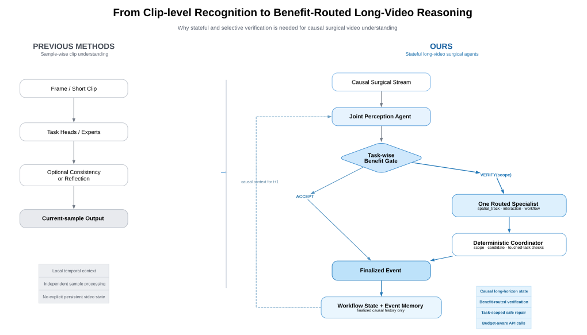

> **2026-09-03 supersession notice:** The complete online Pipeline, branch
> semantics, Repair, Coordinator, outcomes, state, fields, and pseudocode are
> governed only by
> [`Streaming_Surgical_Final_Pipeline_Architecture_and_Pseudocode.md`](Streaming_Surgical_Final_Pipeline_Architecture_and_Pseudocode.md).
> The formal Tracker x Gate experiment, labels, clock, statistics, and canonical
> Phase 0/A/B/C/D gates are governed only by
> [`CANONICAL_PIPELINE_TRACKER_GATE_SPEC_2026-09-03.md`](CANONICAL_PIPELINE_TRACKER_GATE_SPEC_2026-09-03.md).
> This older document remains research rationale and historical design context.
> Its conflicting pipeline, scope registry, ablation, phase, and Definition of
> Done text is non-normative. All body text describing a “current” checkpoint,
> backend, or configuration is historical; live status is maintained only in
> [`docs/README.md`](../README.md).

Streaming SurgicalAgent V3.1-API
学术修订版：完整项目与代码架构说明
Benefit-Routed Sparse Specialist Verification for Reliable Causal Surgical Streaming
文档定位
本文件对既有 V3.1 方案进行面向 CCF-A 论文标准的学术修订。修订后的主论文方案采用“同一 API-VLM backbone 作为 Joint Perception Agent 与收益路由的稀疏 Specialist Verification Agents”，同时保留本地模型作为工程 smoke baseline 与传统对照。重点不是证明 API 模型本身更强，也不是把角色数量包装成贡献，而是严格验证：在相同 backbone、相同因果输入和可比上下文下，能否学习何时值得追加昂贵验证、应调用哪个任务范围的 Specialist、哪些历史证据值得相信，以及如何在受约束候选空间内进行证据化修正。本版进一步固定五项方法学约束：一次性 policy-matched Gate refresh、归一化 task-wise mask-aware scoped benefit、WorkflowState 与 EventMemory 的状态语义分离、带 provenance 上界且只在检索时施加一次时间衰减的 reliability，以及默认每个状态最多激活一个 Specialist 的稀疏调用预算。

|项目项|修订后决定|
|---|---|
|版本标识|V3.1-API（建议作为论文主方案标识；旧 V3.1 local-first 方案保留为实现历史/工程后备）|
|主数据集|CholecTrack20；严格沿用现有 train/val/test 划分与 partial-label 语义|
|论文主 Backbone|用户声明 `GPT-5.6 Terra`：一次 Joint Perception + Gate 路由的 same-backbone scoped Specialist Verification；正式实验前必须记录 provider 返回的 exact model identifier|
|本地模型角色|Engineering smoke baseline、传统 surgical recognition reference、API 故障 fallback；不承担主方法性能归因|
|核心研究问题|When and which specialist should be invoked for reliable causal surgical streaming under a limited verification budget?|
|系统主线|Causal Context → Joint Perception Agent → Task-wise Benefit Gate → Sparse Specialist Verification ↔ Reliability-aware Memory|
|核心公平性原则|Same backbone + matched context + same specialist pool/coordinator + matched verification budget|
|禁止声明|未经真实 latency 测量不称 real-time；API self-confidence 不称 calibrated probability；无外部证据不声称 API 未见过公开数据|

依据与修订边界：工程约束继承 v1.1 Implementation Spec；V3.1 的 Gate/Memory/Agent 主线继承现有 V3.1 文档；API backbone、same-backbone fairness、confidence 限制、API cache/cost 与 verifier role-separation 属于本轮基于审稿视角新增的方法学修订。母体 SurgReflect 用于说明“API LVLM + standalone baseline + reflection”的可行组织范式，不直接复制其 benchmark-specific gold-derived 统计。

当前本地研究 profile 已确认 CholecTrack20 位于外部只读数据目录，且 Training/Validation/Testing 三个目录与 20 个 annotation JSON 均存在；运行路径通过 CLI、环境变量或本地配置解析，不进入论文方法定义或跨机器默认值。P1 数据合同已按显式 partial supervision 通过：VID30 使用候选重建验证侧车；VID31 使用 CholecT50 frame-level Instrument/Verb/Target/Triplet presence 与 Cholec80 phase，不使用 instance、bounding box、operator 或 track supervision；原始 10/2/8 划分、20 个视频目录和类别范围不变。P2 Local Smoke 已在同一 canonical pipeline 上完成真实 masked optimizer step、checkpoint 回读、Gold-free 推理、离线评估与原子产物写出；该结果只证明工程链路，不构成论文性能结论。P3 provider-neutral client、canonical request hash、cache、retry/error、usage accounting 与合成图像 mock smoke 已实现，但真实 API smoke 仍为 `BLOCKED`，因此 P3 状态为 `PARTIAL` 且不得进入 P4。主 backbone 的用户声明名称为 `GPT-5.6 Terra`；在 P3 真实 API smoke 取得 provider、endpoint provenance 与 provider 返回的 exact `model_identifier` 前，该名称不得被当作已验证的公开 API 型号，也不得据此声称模型版本可复现。

# 0. 论文 Motivation Figure 冻结内容

Motivation Figure 只回答“为什么从逐样本短片段理解走向有状态、按收益路由的长视频 Agent”，不得塞入完整训练流程，也不得在实验前声称性能或成本已经改善。推荐左右布局：

```text
Previous Methods                         Ours
Sample-wise Clip Understanding           Stateful Long-Video Surgical Agents

Frame / Short Clip                       Causal Surgical Stream
        ↓                                         ↓
Task Heads / Experts                     Joint Perception Agent
        ↓                                         ↓
Optional Consistency / Reflection        Task-wise Benefit Gate
        ↓                                         ↓
Current-sample Output                    Routed Specialist Agent
                                                  ↓
                                         Finalized Event
                                                  ↓
                                         Persistent Workflow / Memory

Local temporal context                   Causal long-horizon state
Independent sample processing            Selective specialist verification
No explicit persistent video state       Budget-aware additional calls
```

图中央只保留一句：`From local recognition to benefit-routed long-horizon reasoning.`

推荐图注：`Previous surgical video understanding methods typically produce sample-wise predictions from frames or short clips, optionally followed by consistency checking or reflection. Our framework maintains causal video-level state and invokes a task-scoped specialist only when its predicted correction benefit justifies an additional call.`

图中 `Previous Methods` 是对代表性单帧、短 clip、多任务和 sample-wise agentic pipeline 的抽象，不声称所有先前方法都具有或缺少同一模块。右侧 `Ours` 表示方法设计，不得在结果产生前标注 better accuracy、lower cost 或 real-time。



可编辑图源与论文导出位于 `docs/figures/motivation/`：`.pptx` 包含原生可编辑 PowerPoint 图形，`.dot` 用于结构级修改，`.svg` 用于 Illustrator/Inkscape 润色，`.pdf` 用于论文排版，`.png` 用于快速预览。

# 1. 学术问题重新定义与论文主张
V3.1-API 不应被描述为“给一个 API 模型再加 Gate、Memory 和多个角色”。更严格的问题定义是：在因果流式手术理解中，强多模态模型的基础感知仍可能出现局部语义错误和跨时间不一致；再次调用同一强模型的任务 Specialist 进行证据化验证可能提高可靠性，但不同错误需要不同验证范围，且每次额外调用都会增加图像传输、token、延迟和成本。同时，长期 Memory 中的历史状态本身并非同样可靠。因而系统必须联合回答是否验证、验证哪个 scope、使用哪些历史证据，并控制错误修复对后续状态的影响。

```text
Scientific Question: Given the same multimodal backbone and causal context, when and which task-scoped specialist should be invoked, what historical evidence should be trusted, and when is a repair sufficiently supported under a limited additional-call budget?
```
建议把论文问题写成“Reliable Causal Surgical Streaming under Limited Additional Verification Budget”，而不是“API-based surgical recognition”。这样算法贡献落在 verification policy、evidence use 和 memory reliability 上，API 只是统一 backbone。

|研究问题|V3.1-API 对应机制|必须用实验回答的问题|
|---|---|---|
|当前发生了什么？|Joint API-VLM Perception + Track/Workflow structured context|在相同 API backbone 下，Track/Workflow 是否稳定改善 I/V/T/IVT/Phase？|
|什么时候、调用哪个 Agent？|Task-wise Verification Benefit Gate + sparse specialist routing|在相同 additional-verification budget 下是否优于 Random / confidence proxy / V1 Rule Gate / binary Joint Verifier Gate？|
|历史证据应该相信多少？|Reliability-aware Event Memory + task-wise retrieval weighting|相较 no/raw/verified-only memory 是否减少错误历史的负面影响？|
|什么时候允许修正？|Candidate-constrained, falsification-oriented Specialist Agents + deterministic Coordinator|Scoped repair 是否比自由二次生成和统一 Joint Verifier 更可靠，且 candidate recall / repair precision / routing precision 是否可解释？|


## 1.1 建议控制为三个论文贡献
1. Track–Workflow Structured Context for Causal API Perception：将 predicted tool trajectory 与只来自 `WorkflowState_(t-1)` 的 historical workflow 以结构化字段提供给 joint VLM perception，避免未来信息和当前 GT Phase 回流。
2. Task-wise Benefit-Gated Sparse Specialist Routing：V1 surgical rules 变成 soft evidence；Gate 学习各 Specialist 的额外验证预期收益，输出 `ACCEPT` 或 `VERIFY(scope)`，而不是简单判断“当前预测是否错误”。
3. Reliability-Aware Evidence-Constrained Same-Backbone Specialist Verification：同一 API backbone 以 `spatial_track`、`interaction` 或 `workflow` Specialist 角色读取 scoped candidates、track/workflow、可信 memory 与 soft priors，只能 KEEP 或在授权 scope 的候选池内 REPAIR；确定性 Coordinator 校验 touched tasks，并按带 provenance 上界的 task-wise reliability 检索历史事件。
不要把 Retriever、Planner、Repair、Graph、LLM Prompt 或 Agent 数量分别包装为创新点。它们是实现组成，核心贡献应围绕“收益驱动的稀疏专业验证 + 可信证据 + 因果流式状态”。

# 2. 与母体 SurgReflect、旧 V3.1 的关系

|方案|基础感知|时间范围|验证机制|Memory|本项目借鉴/改进|
|---|---|---|---|---|---|
|SurgReflect（母体）|API LVLM task-specialized experts|短 clip / sample-level|Coordinator consistency check + targeted reflection|dataset-level retrieval priors|借鉴 same-LVLM standalone baseline、reflection、structured output；不复制 benchmark gold-derived runtime statistics|
|旧 V3.1 local-first|本地 trainable perception|causal streaming|Learned Benefit Gate + local structured verifier（API optional）|video-level reliability memory|保留工程严谨性、Gate/Memory 逻辑；修订主论文 backbone 为 API-VLM|
|V3.1-API（本版）|Joint Perception Agent；本地 tracker/上下文服务|strict causal streaming|Task-wise Benefit Gate + routed same-backbone Specialist Agent + deterministic Coordinator|video-level reliability-aware event memory|把“何时验证、验证哪个任务范围、如何安全写回状态”统一进同一公平实验框架|

关键归因原则分为两个不可互换的比较合同。其一，Backbone-level Framework Gain 比较要求 Single-pass Baseline 与 Full V3.1-API Agent 使用同一个 exact API model identifier、相同 test videos、相同 causal visual window、task ontology、输出 schema 与 EvaluationEngine；两者之差是完整 framework effect，不能拆称 Gate、Specialist 或 Memory 的独立贡献。其二，verification policy/routing 比较还必须固定 Perception outputs/运行定义、Track/Workflow context、candidate generator、Specialist pool、deterministic Coordinator、WorkflowState/EventMemory 与 reliability 配置，仅改变哪些状态进入额外验证及其 scope；否则不能把增益归因于 policy/routing。

# 3. 不可改变的数据、因果与防泄漏契约
以下约束直接继承现有 v1.1 / V3.1 工程规范，是 API 化后仍不能弱化的硬边界。

|契约|正式要求|
|---|---|
|Split|Train 只用于 D0/D1 Gate 数据、G0/G1 学习、policy-matched refresh rollout、train-derived priors / optional calibration；Validation 只用于最终 `tau_B` 等最小 operating-point 选择；Test 使用冻结 G1、`tau_B` 与全部策略，不做 refresh。|
|Gold-free inference|InferenceSample 类型不得包含 GT、LabelMask、gold phase/IVT/track ID。只有独立 EvaluationEngine 可读取 EvaluationTarget。|
|Strict causal|target t 的任何 visual frame、track、workflow、memory evidence 均必须来自 <= t；当前 event 不能检索到自己。|
|Partial labels|V/T/IVT 缺失不得视为 negative；同一 mask semantics 必须覆盖 evaluation 与 Gate benefit target。|
|Track|主结果使用 PredictedTrackProvider；OracleTrack 只能作为 upper-bound diagnostic。若 tracker 在 Track20 上训练，则 Gate data 生成时必须 fold-safe。|
|Workflow|当前 Perception 只能读取独立 `WorkflowStateStore` 中 t-1 及更早 finalized history，不得读取当前 GT Phase、未来 event 或 EventMemory 的 episodic similarity retrieval。|
|Priors|统计型 surgical priors 只能由 train split 构建，必须记录 support/smoothing/provenance；低 support 返回 neutral soft score。|
|Cross-dataset provenance|CholecT50/Cholec80 只作为已审计 VID30/VID31 侧车来源；不得把与 Track20 Validation/Test 同源的视频加入训练。任何额外上游预训练必须先按视频身份去重并单独声明。|
|Video boundary|每个新 video 独立 reset WorkflowStateStore、EventMemory、Tracker online state 与 rolling budget state；不允许跨病例 persistent patient memory。|

现有数据审计还意味着：连续帧数不能等同于独立样本数；IVT supervision 覆盖并不完整，因此 Gate 不能把 IVT confidence 当唯一主信号。API backbone 缓解了小样本训练 perception 的问题，但没有消除“独立 surgery 数量有限”的统计风险。

# 4. V3.1-API 在线主 Pipeline

> **Historical diagram only.** Do not implement this section as the current
> Pipeline; use the 2026-09-03 complete Pipeline source linked at the top.

```text
Streaming Surgical Video
        ↓
Strict Causal Window W_t
        ↓
Predicted TrackProvider + WorkflowState_(t-1)
        ↓
Joint API-VLM Perception → Initial State P_t + candidates
        ↓
Task-wise Gate signals [workflow features + optional explicit memory disagreement]
        ↓
Final G1 Benefit Gate: ACCEPT | VERIFY(scope)
        ↓
Routed same-backbone Specialist [EventMemory evidence only on VERIFY]
spatial_track | interaction | workflow → KEEP | scoped REPAIR
        ↓
Deterministic Coordinator validates scope and candidate
        ↓
FinalizedState → ReliabilityProfile → FinalizedEvent
        ├── WorkflowStateStore.update(FinalizedEvent)
        └── EventMemory.commit(FinalizedEvent)
        ↓
t + 1
```
API 调用语义必须清楚：每个 streaming state 默认有 1 次基础 Perception call；只有 Gate 输出 `VERIFY(scope)` 时增加 1 次对应 Specialist call，主配置默认每个状态最多一个 Specialist。多 Specialist 串行/并行只允许作为预声明 extension 或 cost upper bound。论文中“20% verification rate”只能表示额外验证率，而不能写成“只使用 20% API calls”。

## 4.1 单一运行主干与模块嵌入原则

工程上必须只有一条具有论文语义的 canonical streaming pipeline。P2 的本地模型、P4 的 API Single-pass、P8-A 的 Always Joint Verify、P8-B 的 Specialist probes 和 P11 的完整系统均通过替换同一主干上的 backend/policy/router 实现，而不是复制多套独立流程。这样消融实验只改变被研究模块，数据读取、因果窗口、PredictionRecord、状态提交顺序和 EvaluationEngine 保持一致。

```text
video_start → reset all per-video state
    ↓
resolve InferenceSample + isolated EvaluationTarget
    ↓
snapshot prior Tracker / Workflow / EventMemory / budget state
    ↓
build causal context → Perception → CandidateSet → GateSignals
    ↓
GatePolicy: ACCEPT | VERIFY(scope)
    ↓ VERIFY(scope) only
SpecialistRouter selects exactly one enabled same-backbone Specialist
    ↓
Specialist: KEEP | scoped REPAIR
    ↓
Deterministic Coordinator validates scope / touched tasks / candidate
    ↓
Finalizer → PredictionRecord / FinalizedEvent
    ↓
commit WorkflowStateStore and EventMemory, then advance to t+1

EvaluationTarget ───────────────→ offline EvaluationEngine only
```

提交顺序是方法定义的一部分：当前帧先完成最终决策和 PredictionRecord，再更新 Workflow/Memory；当前事件不得出现在自己的 context 或 retrieval 结果中。Specialist 不得修改其 scope 外任务，Coordinator 不得新增语义，只能拒绝非法更新或执行显式 KEEP fallback。任何异常均必须产生显式失败记录或 deterministic fallback，不得静默改用 GT、最近帧、OracleTrack 或未声明的候选。

# 5. Joint API-VLM Perception：主 Backbone 的严格定义
为了兼顾与母体的 API-LVLM 范式和本项目的 streaming efficiency，主方案不默认拆成 I/V/T/IVT/Phase 五个独立 API experts，而使用一次 Joint Structured Perception call。Task-specialized expert ensemble 可作为附加上界/复现实验，但不能与主方法混用后再归因给 Gate。

## 5.1 输入必须结构化且因果

```text
{  "causal_frames": ["frame_{t-k}", "...", "frame_t"],  "track_context": {    "tracks": [{"local_track_id": 3, "tool_hint": "...", "continuity": 0.91,                "motion_summary": "...", "visibility": "..."}]  },  "workflow_context": {    "recent_finalized_phases": ["..."],    "transition_summary": "...",    "source_max_frame_id": "< t"  },  "task_ontology_version": "..."}
```
Track/Workflow 不建议写成冗长自然语言故事，而应使用 compact structured context。这样既减少 prompt token 差异，也能对 B0/B1/B2 context ablation 精确控制。

## 5.2 输出 schema：初始感知只提供预测与候选

当前主运行协议是 `joint_perception_gate_owned_compact_v1`，保持 **frame-level recognition**：Instrument、Verb、Target、IVT 是 multi-label presence，Phase 是 single-label。CholecTrack20 一帧可包含多个器械和多个交互，因此禁止把整帧 I/V/T/IVT 实现成唯一 `choice`。初始 VLM 只负责稀疏预测和候选排序，不输出 uncertainty、status、flagged fields、Report 或 CoT。可执行 schema 以 `src/surgical_agent/perception/prompts/perception_schema_gate_owned_compact.json` 为准；旧协议只为历史 artifact/cache 审计保留。

```text
{
  "schema_version": "joint_perception_gate_owned_compact_v1",
  "instrument": {
    "selected_ids": [0, 5],
    "topk": [
      {"id": 0, "score": 0.84}, {"id": 5, "score": 0.61},
      <再提供 1 个唯一候选，使 topk 总数严格为 3>
    ]
  },
  "verb": {
    "selected_ids": [1, 2],
    "topk": [
      {"id": 1, "score": 0.72}, {"id": 2, "score": 0.66},
      <再提供 2 个唯一候选，使 topk 总数严格为 4>
    ]
  },
  "target": {
    "selected_ids": [2, 4],
    "topk": [
      {"id": 2, "score": 0.68}, {"id": 4, "score": 0.63},
      <再提供 3 个唯一候选，使 topk 总数严格为 5>
    ]
  },
  "ivt": {
    "selected_ids": [12, 45],
    "topk": [
      {"id": 12, "score": 0.59}, {"id": 45, "score": 0.54},
      <再提供 6 个唯一候选，使 topk 总数严格为 8>
    ]
  },
  "phase": {
    "selected_id": 3,
    "topk": [
      {"id": 3, "score": 0.78}, {"id": 2, "score": 0.18},
      <再提供 1 个唯一候选，使 topk 总数严格为 3>
    ]
  }
}
```

Instrument、Verb、Target、IVT、Phase 的 `topk` 数量分别固定为 3、4、5、8、3。精确数量只约束 `topk`；`selected_ids` 是稀疏预测，可以为空，绝不能为填满 top-k 而添加标签。每个候选必须唯一并按 `{id, score}` 的 score 降序；每个 selected ID 必须属于同任务 top-k，Phase 必须且只能使用单个 `selected_id`。分数语义是 `uncalibrated_rank_v1`，只作为 Gate 的候选分差和排序证据，不解释为校准概率。

严格 parser 先把 wire response 转换为 frame-level `InitialPrediction`；`PredictionFinalizer` 再创建 durable `PredictionRecord`，其中使用 `instrument_ids`、`verb_ids`、`target_ids`、`triplet_ids`、`phase_id` 和五个 dense score vectors，并显式声明 `granularity="frame_multilabel"`。落盘 writer 持久化 `PredictionRecord`，frame-level evaluator 只在隔离的离线边界将它与监督 target 配对，不直接消费 wire 字段名。整帧监督只能来自明确的 frame presence semantics 或版本化、预注册的 instance-to-frame aggregation rule；partial instance annotation 的“未出现”不得静默当成负类。

**延后的 instance-level 扩展不属于 `joint_perception_gate_owned_compact_v1`。** 如果后续正式加入 bbox、track identity 和 per-instance I/V/T/IVT，它必须使用独立、版本化且另行批准的 schema、matching rule 与 evaluator；此时单个 `instances[]` 元素内部可以是一实例一 `choice`，但不得把该字段解释为整帧唯一预测，也不得把两种粒度塞进当前 wire contract。instance-level 与 frame-level 指标必须分表报告，除非 EvaluationEngine 中存在预注册、版本化的 aggregation rule，否则禁止互相转换。

## 5.3 Gate-owned uncertainty

不确定性和验证路由由本地 Gate 独占。Gate 从 selected cardinality、selected score summary、top-1/top-2 margin、IVT closure、triplet compatibility、Phase-IVT consistency、phase transition、temporal change 和 Tracker 支持中计算特征，再输出 `ACCEPT` 或 `VERIFY(scope)`。初始 VLM 不得通过自报 uncertainty 或 status 直接触发 Specialist。若 provider 将来提供经过验证且可校准的 token logprob，可作为新增可选特征；不同 provider 的 raw score 仍不可直接比较。


# 6. Track–Workflow Structured Context
Track 与 Workflow 的作用不是替代 API 视觉能力，而是提供 API 单个窗口难以稳定获得的跨时间证据。主方法应保持 tracker 与 API 视觉语义解耦：tracker 负责时序工具状态，API 负责语义分类，`WorkflowStateStore` 负责紧凑因果 workflow state；`EventMemory` 独立负责 episodic evidence retrieval。两者可消费同一 `FinalizedEvent` 流或底层日志，但接口、状态语义、配置和消融开关必须分离。

|组件|输入|输出|禁止事项|
|---|---|---|---|
|PredictedTrackProvider|<=t frames / detector-tracker state|local track id、bbox trajectory、motion、visibility、continuity score|test 主结果读取 GT track；Agent 第一主线重写 tracker identity|
|WorkflowStateStore|finalized events with source `< current commit`|recent finalized phase history、stability、transitions、tendency、compact temporal state、`source_max_frame_id`|读取 current GT/future；episodic similarity retrieval；依赖 EventMemory 开关|
|EventMemory|bounded per-video finalized events|candidate support、similar events、reliability/provenance evidence、retrieval trace|生成基础 WorkflowContext；存 raw InitialPrediction；跨 video retrieval|
|StructuredContextBuilder|current track + past workflow|compact JSON-like context|把大量历史原文直接塞入 prompt；引入未来帧|

`WorkflowStateStore` 的消费者是 context builder、Perception 和 Gate 的 temporal/workflow features；`EventMemory` 的消费者是 Verification，以及可选且显式命名的 memory-disagreement feature。关闭 EventMemory retrieval 不得关闭 Workflow，两个服务都必须在 video boundary reset，并且只能由 finalized causal history 更新。


# 7. Knowledge-Guided Verification Benefit Gate

> **Historical Gate/scope design.** Current actions, scopes, mandatory routing,
> G0/G1 meanings, and budget behavior come from the two 2026-09-03 sources.
Gate 是本项目最需要严谨定义的学习模块。它不学习“当前答案错没错”，而学习“在当前 evidence profile 下，调用哪个 Specialist 预计能带来多少 masked task improvement”。V1 的规则不删除，而是变成 continuous soft evidence。第一主线的 scope 集合固定为 `S = {spatial_track, interaction, workflow}`，不得在 test 时动态增加角色。

```text
GateFeatures x_t = [phase_ivt_compatibility, ivt_internal_consistency,
phase_transition_anomaly, temporal_prediction_change, track_continuity,
track_semantic_conflict, optional memory_disagreement, candidate_ambiguity,
optional calibrated_logprob_features]

raw_delta_(t,r,k) = error_before_(t,k) - error_after_(t,r,k)
delta_(t,r,k) = raw_delta_(t,r,k) / max(s_k, epsilon)

Delta_(t,r) = sum_k(m_(t,k) * w_k * delta_(t,r,k))
              / (sum_k(m_(t,k) * w_k) + epsilon)

k ∈ {I, V, T, IVT, Phase}
r ∈ {spatial_track, interaction, workflow}
```

`m_(t,k)` 是统一 completeness mask；缺失任务同时从分子和分母排除，既不是零收益，也不是负样本或错误。`w_k` 必须预先声明。`s_k` 只由 train 派生并在 validation/test 前冻结；若 canonical task error 已处于可比的 `[0,1]` 范围，则 `s_k = 1`。禁止从 validation/test 统计归一化尺度。若某 route 因 API/parse/budget 原因没有真实执行，则保存 `route_observed_mask=false`，不得把其收益写成 0。若 `Delta_(t,r) > 0`，说明该 Specialist 在可观测任务上产生净改善；若 `< 0`，说明造成净伤害。

**TBD / BLOCKED: canonical per-sample task error semantics must be resolved before Gate dataset implementation.** 每个 `error_(t,k)` 必须调用唯一 `EvaluationEngine` 的 canonical task definition；在该定义由数据与评估契约确认前，不在本文擅自指定 BCE、CE、F1 surrogate 或其他 loss。Gate artifact 必须保存 per-route/per-task deltas、`route_observed_mask`、task masks、weights、scales、normalization version、snapshot id、rollout policy id、source split 与 generation version。

Gate 第一版使用共享轻量 encoder + 三个线性/MLP heads，预测 `benefit_hat(scope)`；未观测 route 通过 `route_observed_mask` 从训练 loss 排除。最终部署模型不是直接由 Always-Verify 数据得到的 bootstrap Gate，而是经一次 policy-matched refresh 后的 G1；validation 只冻结最终 operating threshold `tau_B`、预声明的 route tie-break 与最小 calibration。不要因为“多 Agent”就上 Transformer。

## 7.1 Gate runtime policy

```text
r_star = argmax_r benefit_hat_(t,r)
if benefit_hat_(t,r_star) > tau_B and causal_budget_allows(r_star):
    action = VERIFY(r_star)
else:
    action = ACCEPT
```
第一主线每个状态最多选择一个 scope。主 online policy 不能在 test video 结束后做 global top-k benefit 排序。若需要控制平均 budget，可实现只使用过去和当前状态的 causal token-bucket controller；全视频 top-k 或事后挑选最佳 Specialist 只能作为 `oracle_offline_budget` / `oracle_route`。

## 7.2 Gate supervision：一次性 Policy-Matched Refresh
如果 API Perception 是 frozen、未在 CholecTrack20 train split 上 fine-tune，则不需要像旧 local-first 方案那样每个 fold 重训 VLM。但 Gate data 仍必须只来自 train videos，并保证上游任何可训练 tracker/calibrator/prior 不泄漏 held-out video。

```text
Stage 1  D0 bootstrap data:
         train-only scoped counterfactual rollout; freeze each pre-decision state;
         branch ACCEPT vs each enabled Specialist from the same snapshot;
         cache every executed route and preserve route_observed_mask.
Stage 2  Train bootstrap Gate G0 from D0.
Stage 3  Run a true causal G0 selective rollout on train videos, including
         actual ACCEPT/VERIFY(scope), KEEP/REPAIR, FinalizedState, WorkflowState and
         EventMemory transitions.
Stage 4  Build D1 from all encountered states on the actual G0 trajectory,
         not only states selected for VERIFY; branch ACCEPT vs each observed/enabled
         Specialist from each frozen pre-decision snapshot.
Stage 5  Train final Gate G1 from D1, or use one predeclared fixed D0+D1 policy.
Stage 6  Use validation only for final tau_B/minimal calibration; test runs the
         frozen G1 + tau_B and performs no refresh.
```

同一分叉的 immutable pre-decision snapshot 必须共享 causal frames、predicted track、`WorkflowState`、`EventMemorySnapshot`、scope-specific candidate sets、soft priors 与 `InitialPrediction`。D0/G0 只用于 bootstrap，不得在论文中冒充 final deployed gate。D1 必须覆盖 G0 实际 trajectory 遇到的全部状态，避免只在 VERIFY-selected states 上造成选择偏差。Runtime 不得任意混合 D0/D1；若采用合并训练，配方必须在训练前固定并记录。全流程只允许一次 `D0 → G0 → selective rollout → D1 → G1` refresh，不扩展为无限 policy iteration、RL 或 DAgger。

# 8. Same-Backbone Sparse Specialist Agentic Verification
使用同一 API backbone 做第二次调用是合理的，但必须证明第二次调用不是“retry”或装饰性的角色提示。Perception 与 Specialist Verification 需要不同角色、不同输入结构和不同允许动作。Gate 只路由一个明确 scope；Specialist 采用 evidence-conditioned、falsification-oriented prompt，先寻找支持/反驳 H0 的证据，再在该 scope 的受约束候选池内 KEEP 或 REPAIR。

|Perception Call|Routed Specialist Call|
|---|---|
|任务：What is happening?|任务：Is H0 sufficiently supported, or should one candidate replace it?|
|输入：causal frames + track/workflow context|输入：同一 causal evidence + routed scope + scoped H0/H1...Hk + retrieved reliable events + surgical soft signals|
|输出：初始 I/V/T/IVT/Phase + top-k|输出：KEEP 或 candidate_id + touched_tasks；短 evidence trace|
|允许生成结构化候选|禁止生成 scope/ontology/candidate pool 外的新语义标签|

第一主线只定义三个 Specialist：

|Specialist scope|主要检查|允许修改|明确禁止|
|---|---|---|---|
|`spatial_track`|器械类别、proposal 对应关系、track 语义连续性|已有 prediction/track proposal 上的 instrument 语义；若 P5 合同允许，可修正 proposal-to-track association|新增/删除实例、生成新 bbox、改写 tracker identity|
|`interaction`|Verb、Target、IVT closure 与实例内组合|同一 `prediction_id` 下的 V/T/IVT candidate|跨实例拼接 I/V/T、修改 Phase/bbox/track|
|`workflow`|Phase、阶段转移、Phase-IVT soft compatibility|`frame:phase` candidate|修改实例语义、用当前 GT Phase 或未来状态|

确定性 Coordinator 不是额外 LLM Agent。它只校验 `agent_role`、`scope_id`、`selected_candidate_id` 与 `touched_tasks` 是否一致，拒绝越权更新，并把合法 KEEP/REPAIR 交给 Finalizer。这样多 Agent 的作用来自任务范围与动态路由，而不是多一次自由生成。


## 8.1 Candidate pool 与 repair 上界
候选池应由 Perception top-k、task-level top-k 的 ontology-valid 组合，以及可选的 train-only soft prior reranking 构成，并按 scope 隔离。K 应较小（例如每个 scope 配置 3–5），并必须报告 scope-wise `CandidateRecall@K`。若 GT 不在候选池，Specialist 理论上无法修正，这个指标用于区分“candidate generation 问题”“routing 问题”和“verification reasoning 问题”。

```text
Specialist output schema{  "agent_role": "spatial_track|interaction|workflow",  "scope_id": "inst:0:ivt|frame:phase|...",  "decision": "KEEP" | "REPAIR",  "selected_candidate_id": "H0|H1|...|Hk",  "touched_tasks": ["ivt"],  "evidence_for": ["frame:t", "track:3", "memory:event_17"],  "evidence_against_h0": ["prior:phase_ivt", "temporal:transition"],  "rationale_short": "...",  "schema_version": "specialist_v1"}
```
`rationale_short` 仅用于 case study 与人工审计，不直接当作正确性证据。代码层必须校验 candidate_id 属于对应 scope 的候选集合，且 touched_tasks 是该 Specialist 的允许子集；非法 JSON、越权 task、ontology 外选择或缺失字段进入 deterministic KEEP fallback，而不是静默接受。

## 8.2 Same-model self-confirmation 风险的控制
• 每个 Specialist prompt 必须以“falsify current hypothesis first”为原则，而不是“请确认是否正确”。
• Specialist 必须看到与其 scope 相关的新证据：retrieved memory、track/workflow conflict、soft priors、candidate alternatives；不能只重复第一次 prompt。
• 主实验 temperature 使用 provider 可用的最确定设置；所有响应缓存。
• P8 必须先证明统一 Joint Verifier 具有净收益，再证明 scoped Specialist 至少在 repair precision、harm、cost 或任务收益之一上优于/补充统一 Verifier；否则不得把 sparse multi-agent 写成主贡献。
• 附加实验可使用异构更强 verifier 或多 Specialist 并行，但只作为 extension，不与主贡献混淆。

# 9. Reliability-Aware Surgical Event Memory
Memory 是同一 video 内的 persistent service，不是 benchmark-wide knowledge base。它只能存 FinalizedEvent；raw InitialPrediction 禁止直接 commit。API 化后尤其不能把模型自报 confidence 直接当“正确概率”。

```text
FinalizedEvent = {  video_id, frame_id,  I, V, T, IVT, Phase,  predicted_track_state,  verification_status,  evidence_refs,  reliability_profile,  provenance}
```
建议 `ReliabilityProfile` 保留 global + task-wise score。第一版由 temporal agreement、track agreement、workflow compatibility、candidate stability、verification evidence margin 等确定性证据得到 `q_base(task)`，并明确称 reliability score，而不是 correctness probability。随后施加 provenance-aware upper bound：

```text
q_capped(task) = min(q_base(task), provenance_cap(status, source_quality))

RetrievalScore_i(task)
  = Similarity_i × q_capped_i(task) × TemporalWeight(age_i)
```

`status` 至少包含 `gate_accepted`、`verified_accepted`、`repaired`。cap 是 config-driven 的保守证据上界，其确定协议只使用 train/validation 并在 test 前冻结；它不是 correctness probability，且不得提高 `q_base`。Temporal decay 只在 retrieval 计算 `TemporalWeight(age_i)` 时施加一次，不得先写入 reliability 再在 retrieval 重复衰减。每条 provenance/retrieval artifact 必须记录 base q、capped q、status、source/source quality、applied cap、TemporalWeight、final retrieval score 与 reliability version。

Memory 必须 bounded：至少支持 `max_events_per_video`、recent-first candidate pool、可选按 phase 分桶。记录 retrieval latency、memory size 和完整 retrieval trace。Graph Memory、rollback、多级 quarantine 暂不进入主线。

# 10. API 成本、验证预算与论文指标定义
API baseline 也每个时间步调用一次，因此论文的效率指标必须重新定义。V3.1-API 优化的是“额外验证调用”，而不是把所有 API 调用减少到 Gate rate。

|方法|Base Perception Calls|Extra Verification Calls|Total Calls（近似）|
|---|---|---|---|
|Single-pass Baseline|N|0|N|
|V1 Rule Gate|N|r_rule·N|(1+r_rule)·N|
|Full Sparse V3.1-API Agent（G1 policy；max one Specialist/state）|N|r_v3·N|(1+r_v3)·N|
|Always Joint Verify|N|N|2N|
|Always All Three Specialists（cost upper bound only）|N|3N|4N|

但 call 数仍不够严谨。正式记录 `image_count / image_bytes (if available) / input_tokens / output_tokens / latency_ms / retries / provider_cost`，并至少报告：Performance–Verification Rate、Performance–Total Token、Performance–Latency、Performance–Estimated Cost。
在没有真实 end-to-end latency 数据前，论文只能称 online causal streaming / streaming inference，不能称 real-time。

# 11. 论文实验体系：三层归因结构

> **Superseded experiment design.** The current main ablation changes only
> Tracker and Gate and uses `T0G0/T1G0/T0G1/T1G1`.
实验必须按“总体 framework 是否有效 → 增益是否来自选择性 verification policy → context/memory 组件为何有效”的顺序组织。Layer 1 给出主结论，Layer 2 完成 Gate 归因，Layer 3 解释组件贡献；三层不能混为一张只报告最终 F1 的表。

## 11.1 Layer 1：Backbone-level Framework Gain（主结果）

同一 exact Multimodal API backbone 分成两条路线：

```text
Same exact API model identifier
        /                         \
Single-pass Baseline       Full V3.1-API Agent
        ↓                         ↓
Performance B                 Performance A
        \                         /
          Framework Gain = A - B
```

`Single-pass Baseline` 是一次 causal API perception，不调用额外 Verification，不使用 Gate 决策。`Full V3.1-API Agent` 使用冻结 G1、Track/Workflow、candidate-constrained same-backbone Verification、WorkflowStateStore 与 provenance-aware EventMemory。二者必须共享 exact API model identifier、test videos、causal visual window、task ontology、输出 schema 和 EvaluationEngine；Full Agent 增加的结构化上下文与额外验证属于待评估 framework 本身。

`Framework Gain = Performance(Full Agent) - Performance(Single-pass Baseline)` 只表示整个 V3.1-API framework 的总体增益，不得单独归因给 Gate、Memory 或“更强模型”。主结果首先报告逐任务与 aggregate framework gain、paired per-video confidence interval，以及两条路线的 calls/tokens/latency/cost。

## 11.2 Layer 2：Verification Policy（核心归因）

以下方法必须共享同一 backbone、同一 frozen perception outputs/运行定义、相同 causal context、Track/Workflow、scope-specific candidate generator、Specialist pool、deterministic Coordinator、EventMemory/reliability configuration、ontology 和 evaluation；仅改变哪些状态进入 verification 以及 route scope，并在 matched additional-call/token budget 下比较。

|Policy|说明|
|---|---|
|Never Verify|0% 额外验证；policy 下界|
|Random @ matched rate|与 G1 相同 verification rate/budget|
|Confidence Proxy Gate|使用可用 uncertainty proxy；未校准 self-confidence 不作概率|
|V1 Rule Gate|V1 soft surgical signals + validation-frozen deterministic policy|
|Binary Benefit Gate + Joint Verifier|只学习是否验证，不选择 Specialist；关键路由对照|
|V3.1 Scoped Benefit Gate G1|最终 policy-matched `ACCEPT | VERIFY(scope)`；论文主 policy|
|Always Joint Verify|100% extra joint verification；基础 verifier capability/cost reference|
|Always Each Specialist|分别测量三个 scope 的能力、harm 与 cost；不合并冒充主方法|
|Always All Specialists|每状态三次额外调用；仅 cost/agent upper bound|
|Oracle Gate / Oracle Route|仅 analysis 使用 GT benefit；不进入 runtime|

G0 只作为 `D0 → G0 → D1 → G1` refresh 的训练诊断单独报告，不属于 Layer 2 主 policy 排名。Layer 2 用于回答增益是否来自所提出的选择性 verification policy，而不是简单增加 API calls。

## 11.3 Layer 3：Context / Memory / Reliability Ablation

Context 子实验固定 single-pass perception backbone 与视觉输入：A0 causal frames only → A1 + predicted Track → A2 + historical Workflow → A3 + downstream surgical soft-prior signals。

Memory 子实验固定最终 G1、同一 Specialist pool 与同一 deterministic Coordinator：No Workflow / No EventMemory → Workflow Only → Workflow + Raw Recent EventMemory → Workflow + Finalized-only EventMemory → Workflow + Reliability-weighted EventMemory。`No EventMemory` 不等于 `No Workflow`。

Reliability 子实验固定 Workflow、Finalized-only EventMemory、G1、Specialist pool 与 Coordinator：no reliability weighting → base reliability → base + provenance cap → final provenance-aware retrieval（含唯一一次 retrieval-time temporal weighting）。

## 11.4 多 Backbone 范围

主 backbone 必须运行完整 Layer 1–3。若增加第二 API backbone，只要求重复 `Single-pass Baseline / Always Joint Verify / V1 Rule Gate / V3.1 Full Sparse`，验证 framework trend；第二 backbone 不强制重跑全部 context/memory/reliability 消融。所有 backbone 内部的 Baseline 与 Agent 仍必须使用各自同一个 exact model identifier，禁止跨 backbone 计算 framework gain。

# 12. Evaluation：任务、Agent、Streaming、成本四类指标

|维度|必须报告的指标|
|---|---|
|Recognition|当前 frame-level Instrument/Verb/Target/IVT 使用 mask-aware video-wise mAP：仅对 video/class 有 GT positive 的单元计算 AP，先跨有效 video 聚合同一 class，再跨有定义 class 聚合；IVT 94–99 null classes 只保留 support、不进入 mAP。Phase 逐 video 计算 Accuracy，以及仅覆盖该 video GT-present classes 的 macro-F1，再跨有效 video 等权平均。必须报告 class/video support、excluded classes 与 score semantics。未来 instance-level 指标必须按独立 schema/matching rule 分表报告，禁止混合粒度聚合|
|Framework|同 backbone 的逐任务/aggregate `Full Agent - Single-pass`、paired per-video delta 与 bootstrap CI；同时报告 cost delta|
|Gate/Router|verification rate、scope selection distribution、per-scope benefit regression error/rank correlation、same-budget performance、positive-benefit capture rate、route regret vs oracle route|
|Verification|per-Specialist KEEP/REPAIR counts、repair precision、repair success rate、harm rate、scope violation count（必须为 0）、scope-wise CandidateRecall@K|
|Streaming reliability|temporal prediction switch rate、phase transition error、per-video metrics；可选 track continuity/ID metrics|
|Memory|retrieval hit/support、reliability-weighted vs unweighted delta、memory size、retrieval latency|
|API efficiency|base calls、verification calls、total calls、input/output tokens、images、latency P50/P95、retries、estimated monetary cost|
|Statistics|per-video results、video-level bootstrap CI；Gate training 多 seed（可行时 3 seeds），避免把连续帧当独立样本做显著性结论|

主结果规划至少包含：Table 1 报告同 backbone 的 Single-pass Baseline、Full Sparse Agent、Framework Gain 与成本；Table 2 报告 Layer 2 matched-budget policy/routing comparison；Figure 1 报告 Performance vs Additional Verification Rate/Cost Pareto 曲线；Table 3 报告 Specialist 与 Context/Memory ablation。最终 G1 必须在相同 verification budget 下稳定优于 Random、confidence proxy、V1 Rule Gate 和 Binary Benefit Gate + Joint Verifier，才支持 task-wise sparse routing 命题；G0 只报告为 policy-refresh 诊断。

# 13. API 可复现性与审计：必须成为一等公民
API 系统最容易被审稿人质疑不可复现，因此 request/response cache、prompt version 和 provider provenance 必须直接进入代码架构，而不能放在实验结束后补。

```text
outputs/<run_id>/├── api_cache/<request_sha256>.json├── api_usage.jsonl├── prompts/│   ├── perception_prompt.txt│   ├── joint_verifier_prompt.txt│   ├── specialists/{spatial_track,interaction,workflow}.txt│   └── schema_versions.json├── resolved_config.yaml├── environment.json├── git_info.json├── dataset_manifest.json├── predictions/<video_id>.jsonl├── traces/<video_id>.jsonl└── metrics/...
```

|每次 API call 至少记录|说明|
|---|---|
|provider + exact model identifier|禁止只写“GPT/GLM/Gemini”泛称|
|timestamp + endpoint/config|用于版本漂移审计|
|prompt_version + request_hash|确保同一实验可复现/缓存命中|
|temperature/top_p/max_tokens|记录 provider 实际支持的参数；不存在则标 NOT AVAILABLE|
|raw response + parsed response|解析错误必须可追溯|
|input/output token usage + image count|用于成本曲线|
|latency + retries + error code|用于系统效率和稳定性|
|cache_hit|正式复现实验优先读取缓存，避免二次随机调用|

API 是否见过公开 Cholec 数据通常无法证明。论文不要声称“模型从未见过该数据”；应明确其为不可完全审计的预训练模型，并通过多 backbone 或 local reference baseline 减弱结论对单一 proprietary model 的依赖。

# 14. 推荐项目代码架构（API 修订后）

当前仓库以 `src/surgical_agent/` 为唯一主实现包；`src/streaming_surgical_agent/` 只保留版本兼容命名空间，不得在其中新增第二套业务实现。下方目录是职责图，不要求为了匹配示意而复制已有模块；新代码必须优先落入现有 `surgical_agent` 边界。

```text
StreamingSurgicalAgent/
├── configs/                 # base/data/API/components/experiments/ablations
├── src/
│   ├── surgical_agent/      # 唯一主实现包
│   │   ├── data/            # parser, sidecars, masks, media, windows, dataset
│   │   ├── api/             # client, cache, retry, usage, provider adapters
│   │   ├── models/          # local smoke and API perception backends
│   │   ├── tracking/
│   │   ├── workflow/
│   │   ├── research/        # priors, candidates, Gate, verifier, reliability, memory
│   │   ├── systems/         # one pipeline runner + component assemblies
│   │   ├── training/
│   │   ├── inference/
│   │   ├── evaluation/
│   │   └── artifacts/
│   └── streaming_surgical_agent/  # compatibility only
├── scripts/                 # phase-specific executable entry points
├── tests/                   # unit, integration, cached API fixtures
├── docs/
├── reports/
├── artifacts/
└── outputs/
```
架构原则：API 不是直接散落在 `v31_api_streaming.py` 里的 HTTP 调用。所有 provider-specific 逻辑通过 `api/contracts.py` 和 provider adapter 隔离；Perception 与三个 Specialist 共享 API client/cache，但拥有不同 role/scope/prompt/schema。确定性 Coordinator 位于 provider 之外，只验证 scoped update。这样后续可替换模型而不改 Gate/Memory。

本架构在实现时还必须显式补齐：`workflow/state_store.py`（与 `memory/event_memory.py` 分离）；Gate 的 `d0_builder.py`、`bootstrap_train.py`、`policy_matched_rollout.py`、`d1_builder.py`、`final_train.py`；以及 reliability 的 `base_estimator.py`、`provenance_cap.py` 和仅在 retrieval 层调用的 `temporal_weight.py`。这些名称描述职责边界，不要求无视现有仓库结构机械新建文件。

统一主干上的模块替换关系如下；“关闭”必须使用显式 Null/No-op 实现并保留 trace，不能通过另一条隐藏代码路径绕开主干。

|插槽|P2 工程基线|论文阶段实现|独立消融|
|---|---|---|---|
|Context|causal frames only|frames / +predicted track / +historical workflow|A0/A1/A2，只改变 context 字段|
|Perception|轻量本地 smoke model|同一 exact API-VLM backbone|Layer 1 两支固定 model identifier|
|Candidate|本地预测结构占位，不参与修正|ontology-valid top-k + train-only soft priors|固定 K 与候选来源后比较 verifier/policy|
|Gate/Router|NeverVerify|Random、Confidence、V1、Binary Joint Gate、Scoped G0/G1、Always|共享 Specialist pool/context，matched budget|
|Specialist Verification|Disabled|same-backbone `spatial_track` / `interaction` / `workflow` scoped KEEP/REPAIR|Never/Always/Selective 共享 pool；逐 scope 与 Joint Verifier 对照|
|Coordinator|No-op validation|deterministic scope/candidate/touched-task validator|所有策略共享；不得改写语义|
|Workflow|No-op store|causal finalized WorkflowStateStore|no-workflow 独立于 no-memory|
|EventMemory|No-op store|bounded finalized-event retrieval|none/raw/finalized/reliability|
|Evaluation|唯一离线 EvaluationEngine|持续扩展同一实现|所有方法共享 task/mask semantics|

# 15. 核心接口与职责边界

|接口/类|输入|输出|禁止职责|
|---|---|---|---|
|ApiClient|ApiRequest|ApiResponseRecord|不得包含 task-specific prompt 逻辑|
|ApiJointPerception|InferenceSample + TrackContext + WorkflowContext|InitialSurgicalState + CandidateSet|不得读取 GT / EvaluationTarget|
|SignalExtractor|P_t + causal summaries|GateFeatures + trigger_scores|不得直接决定 VERIFY(scope)|
|ScopedBenefitGate|GateFeatures + causal budget|benefit_hat_by_scope + `ACCEPT|VERIFY(scope)`|不得访问 raw GT/future history；主线每状态最多选一个 scope|
|CandidateGenerator|P_t top-k + ontology + train-only soft priors|scope-isolated H0...Hk|不得从 test labels 构造 candidates；不得跨实例混候选|
|SpecialistRouter|GateDecision + enabled role registry|one SpecialistBackend|不得事后使用 realized benefit 选 route|
|SpecialistVerifier|scope candidate set + causal evidence + MemorySnapshot|KEEP/scoped REPAIR + touched_tasks + evidence trace|不得自由输出 scope/candidate pool 外标签|
|DeterministicCoordinator|GateDecision + SpecialistResult + CandidateSet|validated update / KEEP fallback|不得新增候选或调用 GT|
|ReliabilityEstimator|FinalizedState + evidence trace + history|ReliabilityProfile|未经 calibration 不得输出“正确概率”语义|
|WorkflowStateStore|FinalizedEvent / current causal query|compact WorkflowState|不得做 episodic similarity retrieval；不得依赖 EventMemory 开关|
|EventMemory|FinalizedEvent / query|summary / retrieved evidence|不得 commit InitialPrediction；不得跨 video 泄漏|
|EvaluationEngine|PredictionRecord + EvaluationTarget|metrics|唯一可读取 GT 的主运行组件|


# 16. 实施顺序：研究生 + Codex 可执行的阶段化计划
API 版本仍必须从基础框架逐步增加模块，不允许一次生成 Full V3.1。建议把旧 P0–P12 更新为以下顺序；每阶段真实运行 tests/smoke 后才能进入下一阶段。

|阶段|目标|通过条件|
|---|---|---|
|P0 Audit + Docs + Scaffold|审计 repository；更新本版说明；搭 API abstractions / schemas / test skeleton|import/config/pytest collect 真实通过；不明确数据标 BLOCKED|
|P1 Engineering Hard Gates|parser、causal、mask、Gold-free、checkpoint/eval contracts|causal/mask/no-GT tests PASS|
|P2 Local Smoke Baseline|在同一 canonical pipeline 上实现最小本地 baseline，保证 Data→Train-smoke/Infer→PredictionRecord→Eval→Artifact 链路|真实完成至少一个 masked backward/optimizer step；VID02、VID31、VID30 路由测试通过；Test 不参与训练/选择；不追求论文性能|
|P3 API Client + Cache|provider adapter、request hashing、cache、usage/error log|mock + 小额真实 API smoke；schema parse 稳定|
|P4 API Single-pass Baseline|Joint API Perception；frames-only 与 structured output|B0 可完整 rollout/evaluate|
|P5 Track + Workflow Context|PredictedTrackProvider、causal workflow summary、context builder|A0/A1/A2 context ablation 可运行|
|P6 Train-only Priors + Soft Signals|prior store / surgical signals|support/smoothing/provenance tests PASS|
|P7 EventMemory + Candidate Generator|复用 P5 独立 workflow store；新增 bounded episodic memory、snapshot、candidate pool、CandidateRecall diagnostic|Workflow/Memory 独立开关/reset；无自检索/无 raw commit；snapshot immutable|
|P8-A Joint Verification Probe|same-backbone Joint Verifier；先小样本后 Always Joint Verify|先证明第二次证据化调用有非零且可重复净收益；否则 Gate/Specialist 路径 BLOCKED|
|P8-B Specialist Promotion Probe|从同一 snapshot 分别调用三个 scoped Specialists，与 Joint Verifier 比较|至少一个 scope 在预声明任务/困难子集上改善 benefit、repair precision、harm 或 cost；否则不得把 multi-agent routing 作为主贡献|
|P9 D0 Scoped Bootstrap Dataset|train-only ACCEPT + per-scope paired counterfactual；same immutable pre-decision snapshot；fold-safe tracker|normalized task-wise mask-aware scoped benefit、route_observed_mask；D0 provenance 完整；no test leakage|
|P10-A Bootstrap G0|由 D0 训练轻量 multi-head bootstrap Gate|G0 可复现输出 benefit_hat_by_scope，且明确不是部署 Gate|
|P10-B Policy-matched Train Rollout|用 G0 在 train videos 运行真实 causal sparse routing trajectory|实际 ACCEPT/VERIFY(scope)、KEEP/REPAIR、WorkflowState/EventMemory transitions 可审计|
|P10-C D1 Dataset|从 G0 trajectory 的全部 encountered states 生成 same-snapshot scoped benefit|D1 覆盖全部状态；未执行 route 不伪造零收益；artifact/version 完整|
|P10-D Final G1|由 D1 或预声明固定 D0+D1 配方训练最终 Gate|G1 artifact 与训练配方冻结|
|P10-E Validation Operating Point|仅选最终 `tau_B` / 最小 calibration|不重训 Gate；test 前全部冻结|
|P11 Full V3.1-API Runtime|冻结 G1 + `tau_B` + route tie-break、Sparse Specialist pool、Coordinator、独立 WorkflowState 与 provenance-aware EventMemory|Gold-free per-video streaming rollout 完整；每状态最多一个 Specialist；no test refresh|
|P12 Paper Experiments + Cost|Layer 1 Framework Gain、Layer 2 matched-budget policy/routing、Layer 3 Specialist/context/memory/reliability ablation、cost/latency、multi-seed/statistics|同 backbone 主结果优先；policy 与 route 归因严格；所有主张都有 matched controls + artifacts|

关键研究闸门分两级：P8-A 的 `Always Joint Verify > Never Verify` 不是要求每个任务都必须提升，而是要求在预定义主要指标/困难子集上出现可重复净收益并报告 harm；否则所有 Gate/Specialist 路径 BLOCKED。P8-A 通过后，P8-B 还必须证明 scoped Specialist 相对 Joint Verifier 有可解释的任务或效率价值；否则可继续双角色 Agentic Verification，但不得声称 sparse multi-agent 是主贡献。一次 policy-matched refresh 不能绕过任何一级门槛，也不能靠 Gate “创造”不存在的 Agent value。

# 17. 必须具备的测试与审计

|测试类别|至少覆盖|
|---|---|
|Causality|window max frame <= t；workflow/memory max source frame < current commit；无 current self-retrieval|
|Gold-free|InferenceSample/API prompt builder 无 GT/LabelMask/OracleTrack 字段|
|API schema|malformed JSON、invalid candidate id、ontology-out selected ID、agent_role/scope/touched_tasks 不一致、timeout/retry、cache replay|
|API provenance|request hash 稳定；cache hit 不重复计费；usage 统计一致|
|Track safety|main config 禁止 OracleTrack；fold-safe 标记|
|Gate pair|ACCEPT/各 scope 分支共享相同 MemorySnapshot/context；Δ 使用 mask；未观测 route 使用 observed mask 而非零收益|
|Gate refresh|D0/G0/D1/G1 全部 train-only；G0 rollout 因果；D1 来自实际 trajectory 的全部 encountered states；test 禁止 refresh|
|Benefit target|缺失任务同时排除分子/分母；normalization 仅 train-derived 并冻结；artifact 可确定性重建 global/per-task benefit|
|Workflow / Memory|关闭 EventMemory retrieval 时 Workflow 仍工作；独立开关/reset；两者只读 finalized causal history|
|Reliability|provenance cap 不提高 q_base；q 在 `[0,1]`；test policy 冻结；TemporalWeight 随 age 单调且只施加一次；trace 可重建 final score|
|Budget|online threshold/token-bucket 不访问未来 benefit；offline top-k 强制标 oracle|
|Specialist safety|主配置每状态最多一个 Specialist；scope 外修改被 Coordinator 拒绝；route registry/test 配置冻结|
|Evaluation isolation|只有 EvaluationEngine 读取 EvaluationTarget|
|Regression|固定 cached API fixtures 跑 deterministic integration tests|


# 18. 作为 CCF-A 审稿人的主要风险与修正状态

|潜在质疑|本版修正|仍需实验验证|
|---|---|---|
|提升是否只是因为 Full Method 用了更强 API？|Layer 1 两支使用同一 exact model identifier，并同时报告 Single-pass、Full Agent 与同 backbone 差值；禁止用跨 backbone 差值宣称 Framework Gain|需要至少一个主要 backbone 完整实验；最好第二 backbone 验证核心趋势|
|Full Method 拿到更多上下文当然更强？|Layer 1 明确估计完整 framework effect；Layer 3 单独做 context ablation；Layer 2 policy 比较共享同一 context|确保 prompt token/context 完全记录|
|第二次调用只是模型自己确认自己？|Joint probe 先证明调用价值；Specialist role/scope-separated + falsification-oriented + new evidence + constrained candidate|逐 Specialist 报告 repair precision/harm；若不优于 Joint Verifier，不主张 multi-agent|
|多 Agent 是否只是角色提示词堆叠？|Gate 学习 task-wise counterfactual benefit，动态选择一个临床任务范围；Coordinator 强制 scope 边界|必须用 Binary Joint Gate、Always Each Specialist、Always All Specialists 和 Oracle Route 对照|
|API confidence 不可信？|核心 Gate 不依赖 self-confidence；logprob 仅 provider 支持且校准后使用|做 feature ablation|
|Gate 小数据过拟合或训练/部署分布错配？|train-only video-level data；一次性 D0→G0→D1→G1 policy-matched refresh；轻量模型；val 只调最终 τ_B；per-video CI|最好第二数据集/第二 backbone；至少 video-level bootstrap；报告 G0/G1 差异|
|API 不可复现？|cache + exact model/prompt/version/usage/latency|投稿前冻结 cache 与 release manifest|
|效率结论夸大？|区分 base calls 与 extra verification；报告 tokens/cost/latency|不能只报 verification rate|
|是否 real-time？|默认只称 online causal streaming|只有真实 P50/P95/FPS 支持后再声明|


# 19. V3.1-API Definition of Done

> **Historical checklist.** Live progression and acceptance gates are canonical
> Phase 0/A/B/C/D in the Tracker x Gate protocol.
1. Engineering Foundation 的 parser、causal window、partial-label masks、Gold-free inference、video reset、offline evaluation 全部有测试并通过。
2. API Client/Cache/Usage 层独立于任务逻辑；相同 request 可稳定 cache replay；model/prompt/version/token/latency 可追溯。
3. Single-pass Baseline 与 Full V3.1-API Agent 使用同一个 exact API model identifier、相同 test videos、causal visual window、ontology、输出 schema 和 EvaluationEngine，并均可完整运行。
4. 主结果首先报告逐任务与 aggregate 的同 backbone `Framework Gain = Full Agent - Single-pass Baseline`、paired per-video confidence interval 及 calls/tokens/latency/cost；不得用跨 backbone 差值宣称 Framework Gain。
5. Predicted Track + historical Workflow structured context 只使用 <=t 的信息，且 context ablation 可独立运行。
6. 三个 Specialist 使用相同 backbone 但 scope-separated prompt；只能 KEEP 或从对应 scope candidate pool REPAIR；Coordinator 拒绝越权 touched_tasks；逐 scope 报告 CandidateRecall@K、repair precision、harm rate。
7. P8-A Joint Verify probe 有可重复净收益，且 P8-B 至少一个 Specialist 显示相对 Joint Verifier 的任务/效率价值；任一门槛失败均按前述边界降级主张或报告 BLOCKED。
8. D0 只来自 train split 的 scoped counterfactual rollout；ACCEPT/各 route 使用 same immutable pre-decision snapshot，未观测 route 显式 mask，tracker/prior/calibrator 无 held-out leakage。
9. G0 由 D0 可复现训练，输出 per-scope benefit，并且只作为 bootstrap / diagnostic Gate。
10. Policy-matched refresh 在 train videos 上运行真实 causal G0 sparse-routing trajectory，D1 覆盖其中全部 encountered states。
11. G1 由 D1 或预声明固定 D0+D1 配方训练；validation 只冻结最终 `tau_B` / 最小 calibration；test 使用冻结 G1 且不 refresh。
12. Normalized task-wise benefit 对 I/V/T/IVT/Phase 使用统一 mask，缺失项排除分子和分母，scales 仅 train-derived；canonical per-sample task error 未确认前 Gate dataset 状态为 BLOCKED。
13. WorkflowStateStore 与 EventMemory 的接口、状态语义、配置、reset 和消融开关独立；关闭 EventMemory 不关闭 Workflow。
14. Provenance-aware reliability 满足 `q_capped <= q_base`，记录完整 provenance，并且 temporal decay 只在 retrieval 时施加一次。
15. Layer 2 在相同 backbone、perception、causal context、Track/Workflow、scope candidates、Specialist pool、Coordinator、memory/reliability 与 matched budget 下比较 Never、Random、Confidence、V1、Binary Joint Gate、Scoped G1、Always Joint/Each/All 和 analysis-only Oracle Route；G0 仅作诊断。
16. Layer 3 的 Specialist、context、memory 与 reliability 消融可独立运行，并记录 memory size/retrieval latency/trace。
17. 若使用第二 backbone，只运行 Single-pass、Always、V1 与 Full V3.1 核心趋势；完整 policy/ablation matrix 保留给主 backbone。
18. Test 只运行 frozen prompt/config/G1/threshold/Workflow/Memory/reliability policy；任何 GT 只进入 EvaluationEngine。
19. 主结果按 Framework Gain、policy attribution、component ablation 顺序报告 recognition、per-video/statistics、verification behavior、API calls/tokens/latency/cost，不把 extra verification rate 描述成总 API rate。
20. 论文方法主张严格限于实验能够支持的范围；不把 framework gain 解释为单一组件贡献，不把 reliability score 称为 correctness probability，不把 online streaming 称 real-time，除非完成相应验证。

# 20. 建议论文叙述模板
Problem Statement（可直接转为论文 Introduction 逻辑）：

```text
Strong multimodal models provide competitive surgical scene understanding, but causal streaming deployment introduces a reliability-efficiency dilemma. A single-pass prediction may be locally plausible yet temporally inconsistent, while invoking every specialist at every state is costly and may propagate unreliable history. We therefore study benefit-routed sparse specialist verification for causal surgical streaming: when and which specialist should be invoked, which historical evidence is trustworthy, and when a scoped repair is sufficiently supported.
```
核心结论只有在以下条件成立后才可以写进论文：同一 exact backbone 的 Full V3.1 相对 Single-pass Baseline 获得有统计支持且成本透明的总体 Framework Gain；在相同 context、Specialist pool、Coordinator 与 matched additional verification budget 下，Scoped Benefit Gate 优于 V1 Rule Gate、Random、confidence proxy 和 Binary Joint Gate；Reliability-aware Memory 进一步提高可靠性或降低 harm；Full V3.1 在显著低于 Always-All-Specialists 的额外成本下达到更优 accuracy-cost Pareto。
推荐最终一句话定义：
Perceive jointly → Predict when and which specialist is worth invoking → Verify within a trusted causal scope → Repair only when supported → Remember with reliability.

# 附录 A. 推荐主配置语义（示例）

```text
perception:
  backend: api_joint_vlm
  provider: <provider>
  model: <exact_model_id>
  prompt_version: joint_perception_frame_v1
  response_schema_version: joint_perception_frame_v1
specialists:
  model: ${perception.model}
  roles: [spatial_track, interaction, workflow]
  max_per_state: 1
  candidate_k_per_scope: 5
  coordinator: deterministic_scope_validator
gate:
  model: small_shared_encoder_multihead_regressor
  outputs: benefit_hat_by_scope
  use_self_reported_confidence: false
  threshold_source: validation
memory:
  scope: per_video
  max_events_per_video: <fixed>
  reliability_mode: deterministic_profile_v1
api:
  cache: required
  record_usage: true
  record_latency: true
  fail_closed_on_schema_error: true
```

# 附录 B. 本轮自检结论
经本轮逻辑自检，API 化方案在工程上可实现，且比“本地 baseline + 强 API verifier”具有更好的主实验归因；Framework Gain、policy/routing attribution 与 component ablation 已形成三层互补而不越界的证据链。稀疏 Specialist 不是第四个贡献，而是 Benefit Gate 与受约束 Verification 的联合实现：Gate 预测 per-scope counterfactual benefit，Coordinator 强制角色边界，默认每状态最多一个额外 Agent。policy-matched refresh 缓解 bootstrap 与部署策略的状态分布错配；task-wise normalization/route mask 防止标签缺失和未执行 route 污染 Gate target；WorkflowState/EventMemory 分离避免消融混杂；provenance cap 与 single retrieval-time decay 避免 reliability 过度自信和双重衰减。

当前 P1 时间轴、正常非负 ontology 和训练 mask 已达到带证据约束的工程可用状态；Track20 未明文发布的 PNG 抽取措辞与负数 sentinel 医学语义作为 provenance caveat 保留，但不再阻断 P2。第一版 API recognition 的粒度现已冻结为 `joint_perception_frame_v1`：I/V/T/IVT 为 frame-level multi-label，Phase 为 frame-level single-label；这关闭了当前 recognition pipeline 的 P4 粒度歧义，但不授权未来的 instance detection/tracking schema 或 matching rule。真实 API 的 exact provider/model identity 仍必须由每次真实响应和 run provenance 证明，不能由配置名推断。**TBD / BLOCKED: canonical per-sample task error semantics must be resolved before Gate dataset implementation.** 该项只阻断 P9 及之后的 Gate 数据构建，不阻断已经批准的 frame-level perception 与离线指标。canonical error 必须与唯一 EvaluationEngine 对齐，并由数据 annotation semantics 与论文评估协议共同确认，本文不自行假设。另需在实验前预声明 `w_k`、`s_k` 估计规则、D0+D1 是否合并、provenance cap 表及其 train/validation 冻结协议；这些是用户/研究负责人需要批准的 protocol choices，而不是运行时超参数。VID30 仍是候选重建验证源，正式论文必须披露其来源并至少提供排除 VID30 的敏感性结果。
本版不保证最终达到 CCF-A 接收标准；它把当前可预见的方法学漏洞尽可能前置为代码 contract 与实验门槛。最终论文强度仍取决于 Joint Verify 的真实纠错能力、scoped Specialist 相对 Joint Verifier 的增量价值、Learned Router 在相同预算下的优势、跨视频统计稳定性，以及最好存在第二 backbone / 第二数据源的外部趋势验证。
