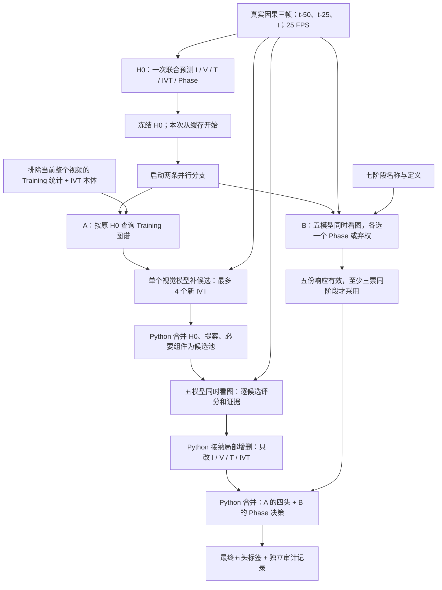

# 最新修复流程：图谱四头修复与独立 Phase 并行

更新：2026-09-10。当前默认版本 **`parallel-phase-repair-v1.3.0-glm-low`**，已在本地工作区接入，尚未创建发布标签。基础发布仍为 `parallel-phase-repair-v1.0.0-experimental`（`research/parallel-phase-repair-v1`）。

**已按用户要求选用五个轻量系列审核模型。** [默认配置](DEFAULT_PIPELINE_VERSION.json)由 `scripts/run_pipeline.py` 读取，转入 `scripts/run_glm_parallel_repair.py`。旧Grok席现为GLM-5.3-Flash，OpenRouter限定Together，强制推理设low；Qwen为35B-A3B，其余三席不变。[运行说明](docs/DEFAULT_GLM_REPAIR_2026-09-10.md)。输出JSON、精简提示、图谱提案与Python接纳规则保持原协议，范围仍为现有八目标入口。该组合未证明Phase净提升，旧默认及实验均保留。

精简提示[配对实测](docs/VERIFIER_COMPACT_PROMPT_TRIAL_2026-09-09.md)：76 对可核实请求输入 Token 全部减少，四头 F1 持平；Phase 表面提升受接口失败影响，已知美元费用略增。默认升级来自用户选择，不代表通过独立准确率验证。**本页下方的历史八目标成绩、费用与 Git 发布链接属于基础 v1.0.0，不是精简提示的新成绩或新发布。** 已准备的旧计划仍按其冻结版本执行、评分。

最新工程完善：默认入口成功执行／评分后输出具体审核拒绝原因报告，模型票数与预测不变。[多方案开发及24新目标确认](docs/DEFAULT_IMPROVEMENT_TRIAL_2026-09-09.md)未支持替换默认算法；其中control使用原提示，不能与精简默认成绩混称。

**一句话：H0 之后，两路同时工作——一路修器械／动作／目标／IVT，另一路重新判断阶段，最后由 Python 合并五头。** 每路内部的五模型也是并行调用。

这是已运行的小样本修复链。当前入口复用固定八目标的 H0，不含 Tracker、Gate、跨目标记忆或多轮循环；目标之间仍顺序处理。默认纯 API H0 入口保持原样。

## 从图片到最终答案



图中的 H0 是前置来源；**这次实测没有重新调用 H0**。Phase 分支在 H0 已就绪后与 A 同时启动，但不接收 H0 标签。当前没有实现“H0 生成期间就提前启动 Phase”。

| 模块 | 输入 | 输出 | 能决定什么 |
|---|---|---|---|
| H0 | 三帧图片、完整本体与联合输出协议 | 五头最终标签 | 提供被冻结的初始答案 |
| 本地图谱 | 原 H0、排除当前视频的 Training 统计 | 最多 2 个完整 IVT 关系提示 | 给补候选提供备选，不证明图片里确实存在 |
| 单模型补候选 | 图片、原 H0、初始池、图谱提示 | 四头新增候选 ID 列表 | 扩大待审核范围，不直接修改答案 |
| 五模型四头 Verifier | 同组图片、同一候选池、审核规则 | 每项 1–5 分、判断、图像引用、观察 | 提供逐项支持或反对；不接收图谱频率或其他模型意见 |
| Python 四头 Repair | 原 H0、候选池、五席有效结果 | 修改后的四头；仍保留原 Phase | 按规则局部增删，不把整帧 I/V/T 从 IVT 重建 |
| 五模型 Phase | 同组三帧、七阶段定义 | 每家一个阶段或 null | 独立判断工作阶段，不接收 H0、候选池或图谱 |
| Python 合并 | A 的四头、B 的单选票 | 最终五头、修改原因与状态 | Phase 只覆盖 `phase`；四头逐值保持 A 的结果 |

**这里的 Repair 是 Python 决策，不是再额外调用一个 LLM 改写整份答案。** 视觉 LLM 已用于补候选和审核；以前的联合 LLM Repair 实验另行保留，没有自动合入本版。

## 数据格式与接纳规则

以下是内部标签及模型输出的格式示意，示例 ID 不代表某个真实目标或 GT。完整动态 Schema 由源码生成。

归一化后的内部 H0／最终标签结构相同（H0 原始 API 响应使用各头的 `selected_ids`／`selected_id`，解析后转为这里的列表）：

```json
{"instrument":[0],"verb":[0],"target":[0],"ivt":[0],"phase":[1]}
```

前四头是可多选的类别集合；Phase 必须单选。没有 top-k 或模型置信度，1–5 审核分也不是校准后的正确概率。

补候选返回四个列表，允许为空；每次上限为 I/V/T 各 2 个、IVT 4 个，池上限 64 项：

```json
{"instrument":[],"verb":[],"target":[],"ivt":[0]}
```

四头审核按候选 ID 归一化。下面只展示一个项；实际请求要求覆盖整个池。Gemini 的原始响应使用 `rows` 数组，程序转为下面的统一 `judgments` 结构，因此不要把示例直接当成五家完全相同的原始请求 Schema：

```json
{
  "judgments": {
    "ivt_0": {
      "rating": 4,
      "finding": "MATCH",
      "scope": "LOCAL_REGION",
      "image_indices": [1, 2],
      "observation": "The target image supports this instrument-action-tissue relation."
    }
  }
}
```

- 每项必须有五个有效审核才能算平均分；一项无效就阻止该项形成有效均分，不能把错误响应算作否定票。
- 均分 **≥4** 支持新增；均分 **≤2** 支持删除；中间或无效时保留原标签、不接纳该新候选。
- 新增 IVT 还要求对应 I/V/T 都得到支持。删除组件前，检查它是否仍被保留的 IVT 使用。
- 删除需要整帧层面的反证；“某局部没看到”不能否定整帧标签。判断与评分矛盾、缺当前帧证据等会使该项无效。
- 若仍有未解决项，记录 `UNRESOLVED`；本版不自动循环。它可以输出已通过的局部修改，不能把该状态理解成整帧全对。

Phase 输出更简单：

```json
{"phase_id":1,"image_indices":[0,1,2],"observation":"Short evidence about the current surgical workflow."}
```

`phase_id` 为 0–6 或 null。五份响应都符合协议，且至少三家选择同一阶段，才采用该阶段；否则保留原 Phase。弃权不降低三票门槛。**Phase 不计算五个 1–5 分的平均值。** 观察文字最多 1000 字符，实际请求包含学术视频分析背景；接口拒绝仍按失败记录与回退规则处理。

两分支使用独立预算、停止标志和请求目录。补候选失败回退 H0 四头；Phase 失败只保留原 Phase。未预期的程序异常会中止并记错，不能把所有异常都掩盖成正常结果。

## 当前模型与调用关系

| 工作 | 请求模型 | 实际路由 |
|---|---|---|
| 本组缓存 H0、单模型补候选 | `google/gemini-3.8-flash` | OpenRouter → Google AI Studio |
| GLM 审核席（历史内部键grok） | `z-ai/glm-5.3-flash` | OpenRouter → Together；强制推理low，隐藏文字仍计费 |
| Qwen 审核席 | `qwen3.5-35b-a3b` | 阿里云工作空间；关闭 thinking |
| GPT 审核席 | `openai/gpt-5.6-luna` | OpenRouter → OpenAI；none |
| Gemini 审核席 | `google/gemini-3.5-flash-lite` | OpenRouter → Google AI Studio；minimal |
| DeepSeek 审核席 | `deepseek/deepseek-v4-flash-vision-exp` | OpenRouter → Fireworks；disabled |

A、B 各调用这五个审核席一次；是 **10 次审核请求，不是同一份回答同时审核五头**。每目标在 H0 后最多 **11 次调用＝1 次补候选＋5 次四头审核＋5 次 Phase**。两路审核重叠时最多 10 个请求在途、同一家最多 2 个。当前不用提供方Batch API，新默认不请求xAI。两席替换的小测试仅验证Phase均分实验，不能代替当前完整默认的语义复测。

默认 `scripts/run_dataset_api_pipeline.py` 仍使用其冻结 Qwen 配置，且只做 H0。不要把它与本页 Gemini 缓存研究结果混为一个已完成的完整 Pipeline。

## 历史v1.0.0同批八目标：最高观测结果与当时执行结果

四个 Training 视频、八目标，所有头的有效 GT 数均为 8，缺失 GT 按任务 mask 排除；Testing 没有参与选方案。单位为百分比，F1 为 micro-F1。

| 方案 | Instrument F1 | Verb F1 | Target F1 | IVT F1 | Phase F1 |
|---|---:|---:|---:|---:|---:|
| 共享 H0 | 66.67 | 61.54 | 51.85 | 29.63 | 62.50 |
| 原图谱一轮 | 69.23 | 66.67 | 57.14 | 40.00 | 62.50 |
| **保留结果：原图谱缓存＋独立短历史 Phase** | **69.23** | **66.67** | **57.14** | **40.00** | **75.00** |
| **最新并行版真实重跑** | **69.23** | **66.67** | **57.14** | **38.71** | **75.00** |

| 方案的 Precision | Instrument | Verb | Target | IVT | Phase |
|---|---:|---:|---:|---:|---:|
| H0 | 69.23 | 66.67 | 58.33 | 33.33 | 62.50 |
| 保留结果 | 75.00 | 62.50 | 61.54 | 40.00 | 75.00 |
| 最新并行版 | 75.00 | 62.50 | 61.54 | 37.50 | 75.00 |

两种 Phase 扩展结果的集合 Accuracy 均为 I/V/T/IVT/P：37.50 / 25.00 / 25.00 / **0.00** / 75.00。Phase 改对 1 个、改坏 0 个、无收益替换 1 个、不变 6 个。

最新重跑 IVT 比保留结果净多 1 个错误预测（TP6/FP10/FN9），新图谱输出在合并 Phase 前就已经如此。相同补候选请求产生了不同回答，两个目标的审核候选池发生变化，审核回答也有变化；不能证明并行调度本身导致下降。旧回答离线并行重放仍与保留结果相同；**最新版本不等于已经证明准确率更高**。正确 IVT 候选仍只覆盖 7/15 个出现项，多数同意与结构合法都不能证明视觉正确。

## 历史v1.0.0时间与费用

最新 8 目标共 **88 次新增请求、203.965 秒（约 3.40 分钟）**，平均 **25.50 秒／目标**，不含重新生成 H0、Tracker/Gate 或 GT 评分。

| 阶段 | 调用数 | 8 目标累计时间 | 美元原生费用 | 阿里云人民币估算 |
|---|---:|---:|---:|---:|
| 单模型补候选 | 8 | 32.420 秒 | $0.02568675 | — |
| 五模型四头审核 | 40 | 166.970 秒 | $0.17856515 | ¥0.072170 |
| 五模型 Phase | 40 | 71.117 秒，与四头分支重叠 | $0.06179683 | ¥0.024006 |
| **整次新增** | **88** | **203.965 秒，含加载与本地处理** | **$0.26604873** | **¥0.096176** |

不要把重叠的 Phase 时间再次加到总时间上。并行区间 199.854 秒比两支路相加得到的串行等效 271.394 秒少约 26.36%；这是同次计时的算术估计，没有额外串行对照。并行没有减少调用数。Grok 是本次八目标四头审核最慢席，平均 20.86 秒；它是后续提速的候选改动，**尚未更换或验证**。

本次 3 个 GPT Phase 请求返回 403，响应声明未扣费；另 1 个 DeepSeek Phase 输出多余字段。四个 Phase 面板按冻结规则回退，未追调。账本预留金额与实际费用分开保留。完整报告与计数快照见下面链接。

## 下载、复现与源码导航

完整代码与重放包在固定标签：

- [下载／浏览最新并行版](https://github.com/litianhao738/streaming-surgical-agent/tree/parallel-phase-repair-v1.0.0-experimental)
- [发布指南：安装、离线重放、真实 API 的前置依赖](https://github.com/litianhao738/streaming-surgical-agent/blob/parallel-phase-repair-v1.0.0-experimental/docs/releases/PARALLEL_PHASE_REPAIR_V1.md)
- [两路调度与合并模块](https://github.com/litianhao738/streaming-surgical-agent/blob/parallel-phase-repair-v1.0.0-experimental/src/surgical_agent/research/verification/parallel_phase.py)
- [实测入口](https://github.com/litianhao738/streaming-surgical-agent/blob/parallel-phase-repair-v1.0.0-experimental/scripts/run_parallel_phase_trial.py) · [Phase 单选规则](https://github.com/litianhao738/streaming-surgical-agent/blob/parallel-phase-repair-v1.0.0-experimental/src/surgical_agent/research/verification/phase_extension.py)
- [阶段隔离实验](https://github.com/litianhao738/streaming-surgical-agent/blob/parallel-phase-repair-v1.0.0-experimental/docs/PHASE_EXTENSION_TRIAL_2026-09-09.md) · [并行实测报告](https://github.com/litianhao738/streaming-surgical-agent/blob/parallel-phase-repair-v1.0.0-experimental/docs/PARALLEL_PHASE_PIPELINE_TRIAL_2026-09-09.md)
- [版本及参数](https://github.com/litianhao738/streaming-surgical-agent/blob/parallel-phase-repair-v1.0.0-experimental/PIPELINE_VERSION.json) · [同批最高观测结果](https://github.com/litianhao738/streaming-surgical-agent/blob/parallel-phase-repair-v1.0.0-experimental/BEST_PHASE_RESULT.json)

新 clone 可以离线重放已发布模型回答及修复决策，不需密钥、图片、GT 或 GPU。原始付费实验入口还依赖本机历史冻结归档、外部数据和凭证，不能把 `--help` 通过写成新机器已完成真实重跑。全量 H0 导入、Tracker/Gate 集成、多目标并发、恢复执行和完整消融仍待完成。

原图谱版本标签 `best-repair-2026-09-09` 与 `prior-graph-repair-v1.0.0-experimental` 保持原提交；其 `BEST_REPAIR_VERSION.json` 是旧四头版本记录，不改写成新的 Phase 结果。本次发布不启动模型调用。
